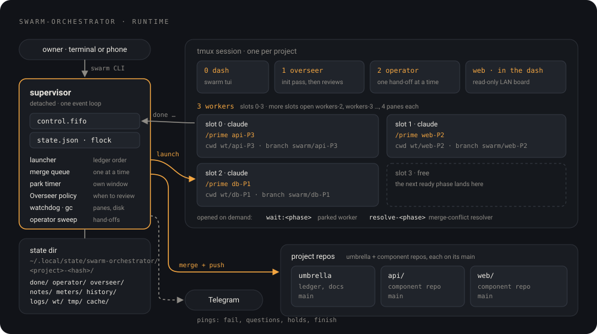
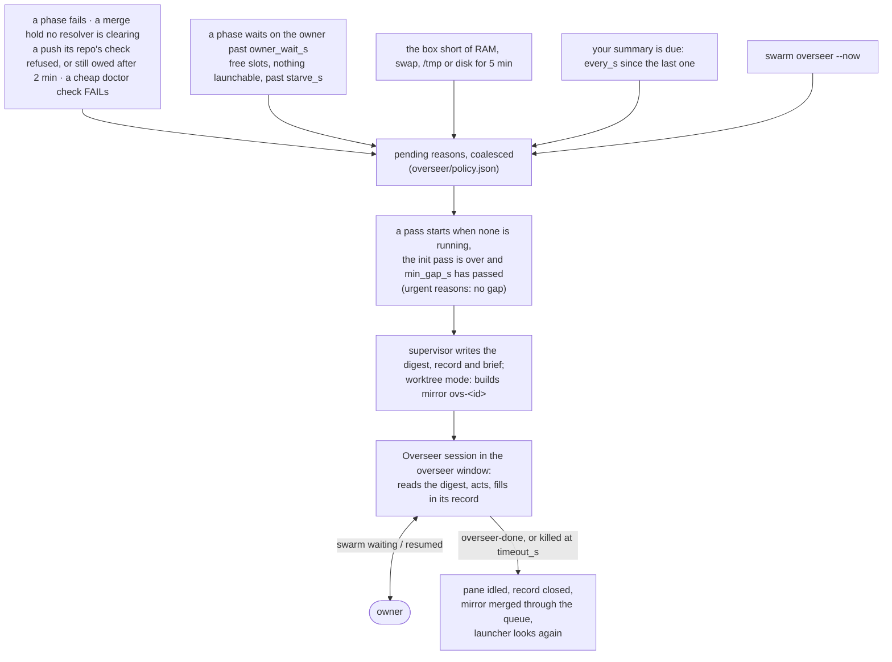
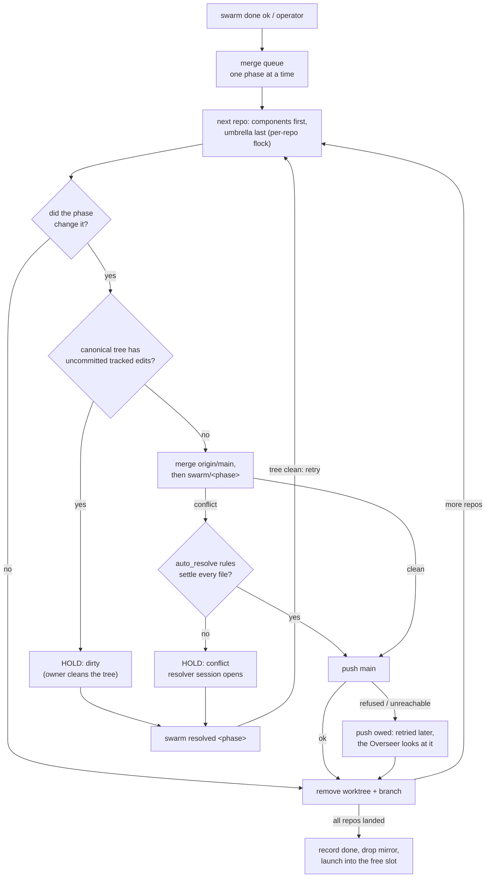
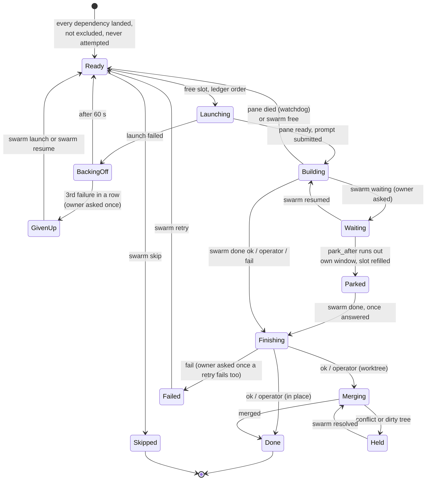

<p align="center">
  
</p>

<h1 align="center">swarm-orchestrator</h1>

`swarm` builds the phases of a project's phase ledger in parallel. It runs several
full Claude Code sessions ("workers") side by side in tmux, one phase each. A small
supervisor process launches every phase the moment its dependencies have landed.
It merges each finished phase back into the project. On Telegram it sends you
two things only: a short ask when something is stopped on you, and a two-sentence
summary every few hours. Nothing in it is specific to a language or a
repository layout: it drives one repo or an umbrella of many, configured by one
`.swarm.toml`.

<p align="center">
  
</p>

## Contents

- [What it can do](#what-it-can-do)
- [How it works](#how-it-works)
- [The cast](#the-cast)
- [A phase's life](#a-phases-life)
- [Lanes](#lanes)
- [Quick start](#quick-start)
- [Answering the swarm](#answering-the-swarm)
- [Command reference](#command-reference)
- [Configuration](#configuration)
- [Runtime state](#runtime-state)
- [Tests](#tests)
- [Contributing](#contributing)
- [Design principles](#design-principles)

## What it can do

- Read a phase ledger (a markdown checklist or a plain one-line format) and work
  out which phases are ready: never attempted, not ticked `[x]`, not excluded,
  every dependency landed (a ticked row counts as landed).
- Keep N Claude Code sessions busy at once. When one finishes, the next ready
  phase starts in its slot within seconds, with no model in the loop.
- Give each phase its own copy of the whole workspace (umbrella repo plus every
  component repo) on a `swarm/<phase>` branch. Two phases can then work in the
  same repo at the same time without touching each other.
- Merge finished phases back one at a time. Common conflicts (ledger ticks,
  append-only journals) are settled mechanically. A Claude resolver session is
  opened only for a real conflict. A failed push does not stop later merges.
- Stop a worker only for a genuine question. The worker sends you a short ask,
  asks in full in its own pane, and if you are away, moves to its own window so its slot keeps
  building something else.
- Hand leftover work (deploys, post-deploy checks, cross-repo chores) to an
  **operator** session that carries it out on your behalf.
- Review the whole run every so often with an **Overseer** session. It retries
  failures, clears stuck state, reshapes the ledger when slots starve, asks you
  for what only you can do, and writes you a two-sentence summary every four
  hours.
- Cap concurrent heavy builds on the machine, across every swarm on it, so
  parallel workers cannot run the host out of memory.
- Show everything live: a terminal dashboard in window 0, a read-only web board
  for a phone or laptop, `swarm status`, `swarm doctor`, `swarm why <phase>`,
  and `swarm report`.
- Measure every run: phases per hour, 5-hour and weekly subscription usage per
  hour, and cost per hour. Past runs are kept in a history.
- Survive crashes. Completion is written to disk before anything else, and
  `swarm up` finishes whatever a dead run left half done and keeps its
  unfinished work for the next attempt.

## How it works

`swarm up` creates a tmux session named after the swarm (`[swarm].name`, by
default the project folder's name) and starts a detached **supervisor**. The
supervisor first runs one **init pass**: a Claude session in the
overseer window that checks Telegram, reads the plan, and patches your worker
command for swarm mode. As soon as the init pass idles, the supervisor launches the
ledger's ready phases, in ledger order, into the free slots. Each worker is a real
`claude` that receives `/prime <phase>` (or your `command_template`), exactly as if
you had typed it.

A worker finishes by running `swarm done <phase> ok|operator|fail "<recap>"`. That
writes a durable sentinel and pokes the supervisor through a FIFO. The supervisor
merges the work (under worktree isolation), records the phase done, and starts the
next ready phase in the freed slot. When nothing is running, ready, merging, owed
or waiting on you, the run finishes and tells you.


Slot accounting lives in `state.json`, not in tmux. Each slot is a record pinned to
a pane tagged `@swarm_slot N`, and a slot is claimed check-and-set under an
exclusive `flock`. A stray pane cannot corrupt the count, and two launches cannot
take the same slot.

## The cast

Each part in a few lines: what it is, when it runs, what it decides and what it may
not do. **[docs/components.md](docs/components.md)** has the full detail of every
part.

### Supervisor

- **Is:** one detached Python process (`swarm _supervise`). It is the only reader
  of `control.fifo`, so every event is handled in one total order. All state
  changes go through `state.json` under `flock`.
- **Runs:** from `swarm up` until the run settles, `swarm finish`, or
  `swarm down`.
- **Decides:**
  - which ready phase goes into which free slot, in ledger order, one launch
    thread each;
  - when to merge;
  - when to park a waiting worker;
  - when an Overseer pass or gc is due;
  - when the run is finished (nothing busy, waiting, parked, launching, queued,
    held or owed).

  A launch that fails waits 60 s before the next try. After three failures in a
  row the phase is given up and you are told once.
- **May not:** build anything, retry a phase that finished `fail`, or kill or
  restart a live worker. An error in one handler is logged, stepped over and
  handed to the Overseer; it never ends the run silently.

### Watchdog

- **Is:** the supervisor's one periodic sweep (`[swarm].watchdog_s`, default 300 s,
  `0` = off).
- **Decides:**
  - frees a busy slot whose pane has died, after two sightings, and keeps that
    phase's work for its next launch (never when tmux itself cannot answer; a
    worker that dies 3 times in an hour is held and you are told);
  - relaunches after a full idle interval with free slots and ready phases;
  - finishes a settled run;
  - retries owed pushes, at most every 15 minutes.
- **May not:** touch a swarm that is making progress.

### Workers

- **Are:** full Claude Code sessions, one per slot. Each is started as
  `<worker_cmd> --settings <worker_settings> --effort <effort>` in the project,
  or in its mirror. Once `claude` has booted, the supervisor types
  `/prime <phase>` (`[worker].command_template`) into the pane and checks that it
  landed.
- **Environment:** each gets `SWARM_PHASE`, `SWARM_STATE_DIR`, a private on-disk
  `TMPDIR`, and in-process teammates (so no extra panes).
- **Decide:** everything inside their phase, following the project's own worker
  command. They record small calls with `swarm note`, ask the owner the big or
  doubtful ones (`swarm waiting`), and finish with
  `swarm done <phase> ok|operator|fail "<recap>"`:
  - `ok` merges silently;
  - `operator` merges the same way and hands the recap to an operator job;
  - `fail` discards the phase's branch under worktree isolation and keeps its
    dependents blocked. The Overseer retries it once; you are asked when it
    fails again (at once with the Overseer off).
- **May not:** push (under worktree isolation the integrator does). Nothing else
  is clamped: tools, permissions and scope are the session's own.

### Init pass and Overseer

Both run in the `overseer` window, never at the same time, spawned and killed only
by the supervisor.

**The init pass** (`prompts/init_master.md`):

- **Runs:** once per `swarm up`. The first launch waits for it.
- **Does:**
  - checks Telegram via `swarm doctor`;
  - reports ledger cycles with `swarm notify`;
  - patches your worker command for swarm mode (skip the phase picker, the
    self-classified `swarm done`, `swarm build`, `note` / `waiting` / `resumed`)
    and commits it;
  - idles.
- **May not:** ask you anything, or launch phases.

**The Overseer** (`prompts/overseer.md`, `[overseer]`, on by default):

- **Is:** a full Claude session that reviews the whole run and acts on it.
- **Runs:** when triggered (diagram below). One pass at a time, at least
  `min_gap_s` apart unless the reason is urgent, and killed after `timeout_s`.
- **Reads:** a digest the supervisor writes, `<state>/overseer/digest-<id>.md`. It
  holds recaps, notes and failures since the last pass, questions waiting on you,
  a starvation map of the root blockers, and a RAM, swap and disk snapshot.
- **Decides:**
  - retries a failed phase once;
  - frees dead slots;
  - clears a hold it fixed;
  - edits the ledger so free slots have work;
  - queues operator jobs;
  - runs gc;
  - pauses the swarm when the box is in danger;
  - asks you for what only you can do;
  - writes your summary every `every_s`: two short sentences.

  It works in its own mirror (`ovs-<id>`) under worktree isolation, merged when
  the pass ends, and leaves a record (*Saw / Did / Left for the owner*).
- **May not:**
  - answer a worker's question;
  - restrain a worker;
  - lift a pause you made;
  - run `done`, `up`, `down` or `finish`;
  - make owner-level calls (money, taste, scope, deleting work, reversing your
    written decisions). Those go to you through `swarm waiting overseer "<question>"`.



### Operator

- **Is:** one Claude session in the `operator` window that carries out work a phase
  could not wait on: deploys, post-deploy checks, provisioning, cross-repo chores
  (`prompts/operator.md`). It holds your authority, so it is **off until
  `[operator].enabled = true`**. While it is off, each hand-off asks you to do
  it instead (`swarm todo` shows the recap).
- **Its queue:** one JSON file per job in `<state>/operator/`. Jobs come from:
  - `swarm done … operator "<recap>"`, where the recap is the whole brief (a
    recap under 20 characters or 4 words queues nothing);
  - `swarm operator-add`;
  - `swarm operator <phase>`.
- **Triage:** a cheap model (`triage_model`) answers `now` or `later`, and
  anything odd counts as `later`. `later` means it can wait for room: the job
  is held until a worker slot is free that no ready phase wants, or for at most
  `[operator].later_wait_s` (3 h by default).
  `swarm operator <phase>` by hand turns a `later` into `now`.
- **Hand-offs:** a job never opens before its phase has merged. It opens at the
  merge (unless triage said `later`), or from the queue sweep on every
  supervisor wake, oldest due job first. Only
  one job runs at a time, under a lease: 1 h, or 7 days while it waits on you. A
  job gets 3 attempts 5 minutes apart. After that it is `abandoned` and you are
  told once. Under worktree isolation it works in its own mirror (`op-<job>`),
  merged on `operator-done`. An outcome that leaves something only you can do
  carries `--ask "<what, then why>"`, and that short ask goes to your phone; a
  decision only you can make is asked first with
  `swarm waiting <job> "<ask>"`, before the job finishes. The rest are folded
  into the Overseer's summary.
  `swarm operator-done <job> "<why>" --not-before <when>` means the job's
  moment has not come yet: it goes back in the queue until `<when>` instead of
  finishing, and the attempt is not counted.
- **Waits longer than the hour:** a session still there when its lease runs out
  is closed and its job queued again, so a session says when it needs longer.
  If the thing it waits on runs without it (a measurement left running on a
  host, a time window), it puts the job back with `operator-done --not-before`
  and a note of where it stopped: the window is free meanwhile, and the job
  opens again at that time, whatever its triage said, with the note in its
  brief. If the session itself has to stay (a build of its own queued behind
  another), `swarm operator-hold <job> <how long> "<why>"` moves its lease, by
  up to 4 h per call; only that session can, and `status` and the dashboards
  show until when. Past the time it gave it is reclaimed as before, without an
  attempt being counted (three times at most per job).
- **Decides:** how to do the job. It checks first whether the work is already
  done, narrates each action, and prefers the step it can undo.
- **May not:**
  - ask you anything except money, taste, unrecoverable data loss, or
    contradicting your written decisions (`swarm waiting <job> "<question>"`);
  - answer worker questions;
  - run `done`, `launch` or `finish`;
  - create branches.

```mermaid
stateDiagram-v2
  direction TB
  [*] --> Queued: swarm done operator (recap is the brief)<br/>or swarm operator-add
  Queued --> Running: dispatched (lease 1 h, attempt +1)
  Running --> Waiting: swarm waiting (owner asked, lease 7 days)
  Waiting --> Running: swarm resumed
  Waiting --> Parked: park_after runs out<br/>own window (wait:op-&lt;job&gt;), operator window freed
  Parked --> Running: swarm resumed
  Running --> Done: operator-done (--ask asks the owner; a decision is asked first)
  Running --> Running: operator-hold (declared long work, lease up to 4 h)
  Running --> Queued: operator-done --not-before (attempt not counted)
  Running --> Queued: lease expired or session would not start<br/>(eligible again after 5 min; a declared hold that ran out is not an attempt)
  Running --> Queued: swarm up (the old run is gone)
  Waiting --> Queued: swarm up
  Queued --> Abandoned: 3 attempts used (owner asked once)
  Running --> Abandoned: 3rd attempt fails
  Done --> [*]: worktree mode: its mirror is merged
  Abandoned --> [*]
```



### Integrator and merge-conflict resolver

- **Is:** under `isolation = "worktree"`, the supervisor's merge queue. It lands one
  phase at a time, repo by repo (components first, umbrella last), under a
  per-repo `flock`. Untouched repos are pruned with no network. A push that fails
  never holds the queue: the repo **owes a push**, it is retried after each
  integration and on the watchdog, and the Overseer is given a pass to fix it or
  ask you.
- **Before a push:** `[git].post_merge` can name a command per repo that the
  integrator runs in the main checkout between the merge and the push, through
  the build gate: for what the repo's pre-push check needs and a merge does not
  bring, such as installed dependencies. One that fails leaves the push owed
  with its own last lines as the reason.
- **Conflicts:** a conflicted merge is first offered to `[git].auto_resolve`
  (`automerge.py`), a map from a path glob to a strategy:
  - `union` keeps both sides, for journals;
  - `keyed:<regex>` merges record by record (word by word inside a record both
    sides changed), for ledger ticks and notes.

  `[git].auto_resolve_check` can name a command that must pass on the merged
  text. It is all-or-nothing. Only if that fails is the queue **held** and a
  **resolver** opened: a Claude session in window `resolve-<phase>`, in the
  conflicted repo (`prompts/resolver.md`).
- **The resolver may:** resolve every marker so that both sides' intent survives,
  commit, and run `swarm resolved <phase>`. If it cannot resolve correctly, it
  tells you and stops.
- **The resolver may not:** push, launch, or work outside that repo.
- **A dirty tree:** a canonical repo with uncommitted tracked edits holds the
  queue too, until you clean it and run `swarm resolved`. That command re-checks
  the repo before it releases the queue.
- **Off main:** the merge never switches your checkout's branch. One on another
  branch holds the queue until you switch back and run `swarm resolved`.
- **`fail`:** a phase that finishes `fail` is rolled back in every repo, with no
  merge. Its unmerged commits are kept under `refs/swarm-attic/` (as is anything
  else the swarm removes), for `[gc].attic_days`.



### Worktree isolation and mirrors

- **Off by default** (`isolation = "none"`): workers commit in the project itself.
- **With `isolation = "worktree"`:** each phase works in `<state>/wt/<phase>`. That
  is a worktree of the umbrella on `swarm/<phase>`, with every component repo
  (`[git].repos`, default every git repo directly under the root) nested at its
  real path on the same branch.
  - It looks exactly like the project, so two phases can build in the same repo
    at once.
  - A mirror starts from local main (or from `origin/main` when that strictly
    fast-forwards it), so your unpushed commits are kept.
  - With `[build].cache`, Rust `target/` dirs share one per-repo cache.
- **Recovery:** on `swarm up`, leftover branches are settled from the durable
  sentinels:
  - finished phases are integrated;
  - interrupted ones keep their work, saved as a commit, and their next launch
    resumes on the same branch;
  - held ones are not marked done.

### Build gate (`swarm build`)

- **Is:** one gate over heavy builds for the whole machine. Every swarm on it
  queues at the same gate: at most `max_concurrent` builds run at once,
  whichever swarms started them, and the rest wait in a queue, served in
  arrival order. A build that usually takes under `short_s` may pass a long
  one, but no long one is passed more than `overtake` times, so one swarm with
  many builds queued cannot starve another. For `cargo` it also sets
  `CARGO_BUILD_JOBS` to the project's `[build].jobs`.
- **Its limits are the machine's:** `max_concurrent`, `short_s`, `overtake`,
  `idle_yield_s`, `idle_yield_max`, `pair` and `alone` are `[build]` in
  `~/.config/swarm-orchestrator/machine.toml`
  ([docs/config.md](docs/config.md#the-machine-file-machinetoml)), not in a
  project's `.swarm.toml`, and none has an environment variable. The file is
  read live: an edit applies to every swarm at once, with no reload or
  restart. A `.swarm.toml` that still sets one of them does not load, and the
  error names the key and `machine.toml`. A project's `[build]` keeps `jobs`,
  `cache`, `heavy` and `light`.
- **Idle holders yield:** a build whose whole process tree does nothing for
  `idle_yield_s` (150 s) is set aside. It is never stopped; it just stops
  counting, so the next build starts beside it, and it counts again if it
  wakes up. At most `idle_yield_max` are set aside at once. Commands whose
  work runs in a daemon (`docker build`, `sccache`, `bazel`…) never yield, and
  neither does one started with `swarm build --hold` (a measurement that must
  have the machine to itself). A command that was set aside is told so in its
  own output. A build whose swarm is frozen (`swarm freeze`) keeps its seat
  and is set aside at once, so the other swarms do not wait on it.
- **Pairing rules (opt-in):** with `pair = "distinct-repo"` two builds, of any
  swarm, run side by side only if they are in different repositories (a repo
  is the same repo from every worktree and mirror of it, and from every swarm
  whose project holds that checkout), and an image build (`alone`, by default
  the container clients), a `--hold` or a build in no git checkout runs with
  no build beside it: it waits for the gate to empty and nothing starts while
  it runs. A script that turns out to call `docker build` is alone from that
  moment. A waiter the rules hold back is passed by one they allow, at most
  `overtake` times; `swarm build --status` says why each waiter waits.
- **Light commands skip it:** `git`, `ls`, `cargo update`/`metadata`/`fmt`/`tree`,
  `docker buildx bake --print`, python scripts that start no processes. Unknown
  commands count as heavy; `[build].heavy`/`light` add patterns.
- **Fails fast:** a heavy command whose program, `cd` target, `-f` file or
  manifest does not exist is refused before it queues.
- **Says what it is doing:** while queued, its place, who is ahead, who holds
  each slot and an ETA from past runs (stderr); then the wait and run times.
  `swarm build --status` shows the gate with every swarm's builds, and so does
  the `build gate:` line of `swarm status`. A build that is another swarm's
  has that swarm's name in front: ``slot 0: [glasheim] W3 `cargo nextest run`
  running 4m``. Every call is logged to `machine/buildsem/events.jsonl` in the
  state root, each line naming its swarm.
- **How:** the build inherits its locks (a seat of its own, and its slot,
  shared), so a killed build frees them. Workers wrap their gates in it
  (`swarm build cargo nextest run`;
  several steps in one turn with `swarm build -- sh -c 'a && b'`). gc holds
  every slot while it deletes, so it never runs while a build of any swarm is
  alive; it waits for that as a ticket in the same queue, holding no slot, and
  builds pass it until the last `[gc].hold_s` of its wait.

### Resource tracking (`swarm resources`)

- **Is:** a sampler thread in the supervisor that records host CPU, pressure,
  memory (anon and page cache apart), swap, disk throughput and real free space
  (WSL-aware), and attributes CPU, memory and IO to each gated build and each
  worker session. One sample a second while a build runs, one every 15 s idle.
  The gate is the machine's, so it measures every swarm's builds and says whose
  each is: a neighbour's build is not counted as this swarm's, nor left in
  "everything else on the host".
- **Why:** so raising the machine's `max_concurrent` (`machine.toml`), or a
  project's `[build].jobs` or `[swarm].max_workers`, is decided from measured
  peaks, not guessed.
  `swarm resources` shows now, the last day, the worst builds and the capacity
  arithmetic. A build that holds a slot idle for 10 minutes is reported (never
  killed), with what the gate did about it. Details: [components.md](docs/components.md#resource-tracking-swarm-resources).

### Stop hook, recaps, notes, report

- **Stop hook** (`scripts/stop-hook.py`, opt-in via `worker_settings`): appends
  each worker turn's final text to `<state>/turns/<phase>.jsonl`. No API call, no
  output.
- **Recaps:** one or two sentences per phase, in `<state>/recaps/`. `swarm done`
  starts one in the background, and `swarm recap` makes one on demand. There is
  no timer. A short completion note is used as is; otherwise
  `claude -p --model haiku` writes it.
- **Notes:** `swarm note` records a decision, assumption or risk without
  messaging anyone. Your own answers, relayed by `swarm resumed`, are kept as owner
  decisions.
- **`swarm report`:** every phase with status, timings and recap, plus warnings
  where the records disagree. `--decisions` shows only what carries a judgement
  call.

### Meters, usage and runs

- **Meters:** each worker's status line is swapped for a tap that records context
  size, session cost, and the account's 5-hour and weekly usage in
  `<state>/meters/`. It then runs your own status line, so the pane looks the
  same.
- **Runs:** a run lasts from `swarm up` to `swarm down`. `swarm reset` (or `R` in
  the dashboard) starts a new run without restarting anything, so usage counts
  from now. The ETA does not reset: it is a simulation of the open ledger fitted
  to past work times and to what the swarm lately delivered, read from the
  ledger's git history, so phases built on another machine count too.
- **`swarm usage`:** each run's hours, phases, average 5-hour and weekly %/h,
  windows spanned, and $/h. The figures are account-wide, so other Claude sessions
  on the same account count too. Each sample is tagged with a short hash of the
  logged-in account, so a `/login` switch is never read as a reset: "now" figures
  are the account in use, and a run across a switch lists each account's share.
- **Usage caps (`[usage]`):** at weekly 60% the swarm stops starting workers
  (running ones finish), at weekly 70% it runs `swarm down`, and at 5-hour 90% it
  pauses too. A pause lifts by itself after the window resets, or at once when
  you log in to another account that reads under the limit; `swarm resume
  --override-cap` runs through it. When the tap's figures are stale, the
  supervisor asks Claude Code's usage endpoint, at most every 30 minutes. Workers
  are never told.
- **On your phone (Telegram):** usage only when you ask: `/usage` to the swarm bot answers
  with both limits, how old the reading is, the caps, and each swarm a cap holds. A cap that
  stops the swarm asks you to start it again; a pause that lifts by itself is
  only in the Overseer's summary.

### Doctor, why, gc

- **`swarm doctor`:** about 25 read-only checks covering the supervisor, slots,
  the run, integration, questions waiting on you, the ledger, Telegram, disk,
  records, the operator, prompts, the web board and the machine's bot listener.
  Exit 1 on any FAIL.
- **`swarm why <phase>`:** the one reason a phase is not running, walking unmet
  dependencies to the root blockers.
- **`swarm gc`:** reclaims disk. It is a dry run unless you pass `--yes`.
  - **Always planned:** caches of repos that no longer exist, `incremental/`,
    superseded cargo units, `cargo sweep` past `keep_days`, orphan mirrors,
    stale temp dirs.
  - **Opt-in:** `--aggressive`, `--transcripts`, `--branches`, `--canonical`.
  - **Safety:** it holds every build slot while it deletes, and none while it
    waits for the builds to end.
  - **Automatic:** the supervisor runs it by itself (`[gc]`): every 15 minutes,
    plus once per idle stretch.

### Dashboard (`swarm tui`)

A Textual app in window 0. It has a status bar (live, frozen, paused or down;
slots; campaign progress; time since the last event) and a needs-you drawer
(`n`). Its
ten tabs, switched with `1`–`9` and `0`, are:

- **home:** ETA, usage outlook, every campaign's finish (the phase books),
  working now, and a feed;
- **workers**;
- **history**;
- **alerts:** Telegram sends, and the messages held back (`·`);
- **disk**;
- **settings:** edits `.swarm.toml` and runs `swarm reload`;
- **commands:** every subcommand, with a confirmation for the destructive ones;
- **doctor**;
- **runs**;
- **shells** (`0`): what `swarm keep` left running, and why.

`R` resets the run, `D` drains (see `swarm down --drain`), `g` opens the owner
guide, `o` reopens the owner console, `?` lists every key, and `q` quits the dashboard only. It fits an 80×24
terminal.

### Web board (`swarm web`)

- **Is:** a read-only board for a phone or a laptop, one for the machine. One
  address shows every swarm: the overview at `/` says first what waits for
  you across all of them, then the totals, then a card per swarm with a button
  into its own board (`/s/<slug>/`), and every swarm's page has the others as
  buttons. `swarm up`, `swarm status`, `swarm doctor` and `swarm ls` print the
  address: the machine's Tailscale IP (the LAN address only when Tailscale is
  absent). `u` in the dashboard copies this swarm's page to your clipboard.
- **Runs:** as a process of its own. Any `swarm up` starts it unless it is
  already answering, and the `swarm down` of the last swarm that is up stops
  it; `swarm web` starts it by hand (over swarms that are down too) and
  `swarm web stop` stops it. Its port is `[web].port` in
  `~/.config/swarm-orchestrator/machine.toml`, never a project's.
- **A swarm's tabs:** Overview (when every phase is done, P50 and P85, what runs now, the
  next usage cap), Phase books (every campaign with its finish range, and a
  status board), Graph (the `needs:` graph laid out left to right: what blocks
  what, the critical path, pan and zoom), Usage (both windows over time with
  their caps and a projection, and the runs), Resources (what `swarm
  resources` prints: the host now, the running and queued builds, history
  charts with every build marked on them, the builds table and the capacity
  scenarios), Activity (finishes, notifications, Overseer passes). A row's full sheet opens from anywhere
  (`#<tab>&phase=<id>`).
- **Light:** it polls only while the page is visible, and an unchanged answer is
  a 304.
- **Safety:** GET only, no URL maps to a file, and credential-shaped strings are
  redacted. It listens on every interface **with no token**, by design. See
  [docs/components.md](docs/components.md#the-web-board-swarm-web) for the WSL
  firewall rule a LAN phone needs.

### Processes and `swarm keep`

- **Everything dies with its session.** Every session carries
  `SWARM_SESSION_ID=<kind>:<id>` and hands it to all it starts. When a worker's
  `swarm done` lands (or the watchdog finds it dead), an operator job ends, an
  Overseer pass ends or a resolver is closed, the supervisor ends every process
  still carrying it, detached ones (`setsid`, `nohup`) included: HUP, TERM, then
  KILL, like `swarm down`.
- **`swarm keep` is the exception**, for something the owner needs after the
  session is gone, and only then:
  `swarm keep --name N --why "<one plain line>" -- <command…>`. It runs detached
  with the session's markers stripped, so it outlives its session and
  `swarm down`, and is listed by `swarm keep --list`, `swarm status`,
  `swarm doctor` (a warning past 7 days) and the dashboard until
  `swarm keep --stop N`. The session names it in its recap or outcome.
  Details: [components.md](docs/components.md#processes-everything-dies-with-its-session-swarm-keep-is-the-exception).

### Telegram, and asking the owner

- **The sender:** the machine has one bot, and every swarm on it sends through
  it: by default `scripts/notify.sh`, reading `TELEGRAM_BOT_TOKEN` and
  `TELEGRAM_CHAT_ID` from this repo's gitignored `.env`. Another script or
  another env file is `[telegram]` in `machine.toml`, never a project's
  `.swarm.toml`. Every send is logged to `<state>/notifications.jsonl`. `swarm notify` is the
  only way a session should message you, even when a brief or a ledger row
  names another script (a `notify.sh`, say); the prompts say so.
  Once you have seen the pings that never arrived, `swarm notify --ack` (or `x`
  on home or the alerts tab) clears the warning: the footer and `swarm doctor` count
  only drops after that. The log itself is kept as it is.
- **What reaches your phone:** two kinds of message, each starting with the
  swarm's name, each at most 280 characters so it reads in a notification.
  - **`[<swarm>] Asks you: …`** when the swarm, a phase or the operator cannot
    move forward until you do or decide something: a question from a session,
    a merge hold you must clear, a failure a retry did not fix, a follow-up
    only you can do, a row that is yours and holds others up, a supervisor that
    crashed, a usage cap that stopped the swarm. The first sentence is what to
    do; the second says why.
  - **`[<swarm>] Overseer: …`** every `[overseer].every_s` (4 hours by default),
    and once more when the run ends: what landed and what is running, then
    whether anything waits on you. Never per number of finished phases, and not
    at all for a stretch in which the swarm stood still.
- **Held back, not sent:** everything else. Routine operator outcomes, parks,
  a first `fail` (the Overseer retries it), an owed push, a usage pause that
  lifts by itself, a conflict a resolver is working on, a worker that died and
  was started again, a web board that did not start. Each is in
  `notifications.jsonl`, on the dashboard's alerts tab (as `·`), and, where it
  matters, in the Overseer's digest so its summary can account for it. `ok`
  finishes say nothing at all. The whole table is in
  [components.md](docs/components.md#telegram-and-asking-the-owner).
- **Short by construction:** a session's ask (`swarm waiting`, `swarm notify`,
  `swarm operator-done --ask`) and the Overseer's summary are refused when too
  long, with the limit, and the session rewrites them. Nothing is cut to fit.
- **Commands:** the bot also listens, with one listener for the machine that
  answers for every swarm on it. `/status` is a line per swarm (how it stands,
  how many phases are done, what waits on you, those waiting on you first),
  `/usage` the account's limits once and then each swarm a cap holds, `/help`
  the list. Any `swarm up` starts the listener when it is not running, and the
  `swarm down` of the last swarm that is up stops it; `swarm telegram-bot` does
  the same by hand. It answers only the chat in `TELEGRAM_CHAT_ID` and ignores
  everyone else. Only one program may poll a bot token: while it runs,
  `scripts/resolve-chat-id.sh` gets a 409, so run that before `swarm up`.
- **Asking:** a worker, an operator job or the Overseer all run
  `swarm waiting <who> "<ask>"` then `swarm resumed <who> "<answer>"`.
  Each sends you its ask once, asks in full in its own pane, and records your
  answer (see
  [Answering the swarm](#answering-the-swarm)).

### Reload, layout, check

- **`swarm reload`:** applies a `.swarm.toml` edit live. Each key is *hot*
  (applied now), *next* (reaches the next session launched) or *restart*
  (refused). A file that does not parse changes nothing.
- **`swarm layout <name>`:** re-arranges the worker panes live (`auto`,
  `side-by-side`, `top-bottom`, `tiled`, …). Each worker window holds at most
  `[tmux].panes_per_window` panes (4 by default); more slots page into
  `workers-2`, `workers-3`, …, so 5 workers at 2 per window are 2, 2 and 1.
- **`swarm check`:** a preflight covering the Telegram sender, the ledger, and
  **promptlint**. Promptlint flags sentences in your worker command or the
  shipped prompts that the code has made false (for example a subcommand that
  does not exist), and measured time-wasters (`sleep` loops, status polling).

## A phase's life



- **Done and skipped** both release a phase's dependents. **Failed** does not: its
  work was rolled back, so nothing may build on top of it, and it stays out of
  `ready` until `swarm retry` clears it (`--cascade` also resets dependents that
  had already run).
- **Waiting and parked** phases keep the run open until they finish.
- **Pause:** `swarm pause` holds new launches while running workers finish;
  `swarm pause --in 12h` (or `--at 03:00`) does the same later, `--cancel` drops
  that, and `swarm status` shows it until it happens. A
  usage cap holds them the same way, on its own record (see
  [Meters, usage and runs](#meters-usage-and-runs)).
- **Freeze:** `swarm freeze` stops every session where it stands (the kernel
  freezer, nothing is ended) and `swarm thaw` wakes them a few seconds apart.
  In between the supervisor launches, reaps, pings and times out nothing, and
  at the thaw every deadline is moved along by how long the freeze lasted, so
  the frozen hours count as nothing. `status`, `doctor`, the dashboard and the
  board say `frozen` (see
  [docs/components.md](docs/components.md#freeze-and-thaw-swarm-freeze-swarm-thaw)).
- **Done-ness** comes from the swarm's own records (`state.json`, seeded from
  `done/` sentinels on every `swarm up`), plus the ledger's checkboxes: a row
  ticked `[x]` that the swarm has no record of counts as done. It is neither
  launched nor holds back its dependents, exactly as the web board shows it. It
  is only a reading of the ledger, never written to the records, so a record
  always wins, and a tick on a phase still in flight releases nothing until it
  lands. Where a row and its record disagree, one rule settles it:
  - *A failed phase whose row was closed since* (`swarm record <phase> done`,
    or a tick by hand that also takes `failed` off the row's status) is no
    failure any more. The swarm drops the failure record and its sentinel
    (`FAIL-CLOSED` in the log), so nothing counts or lists it as failed, its
    dependents go on, and no later `swarm up` brings it back; the failure stays
    in the row's history. A ticked row that still says `failed` was ticked
    first and failed since: it stays failed until `swarm record <phase> done`
    or `swarm retry`, and `swarm doctor` says which.
  - *A phase the swarm landed whose row is still open* stays done and is never
    built again on its own. `swarm status` counts it ("done by the swarm, still
    open in the ledger") and `swarm doctor` names it (`phases.open`): `swarm
    record <phase> done` makes the ledger agree, `swarm retry <phase>` builds
    it again.

## Lanes

Work that touches different files runs at the same time. A ledger row
declares what it edits in a `touches:` field, and each touch takes one of four
forms: `repo/path`, `repo/dir/**` (`repo/**` is the whole repo), `./path` for the
project repo itself, and `@resource` for something that is not a file.

- **Off by default.** `[lanes] enabled = false` keeps the old rule, one phase per
  repo at a time. `true` schedules per touch instead: a ready row whose touches
  overlap nothing in flight launches, and one that overlaps waits.
- **Fair.** A waiting row reserves its touches, so a later overlapping row cannot
  overtake it, while a later disjoint row still launches. `[lanes] per_repo`
  (default 2) caps the phases in flight in one repo. `swarm why <row>` says what a
  row waits for.
- **Legacy rows.** A row with no `touches:` owns everything under its `dir:`, so
  it runs alone in that repo, as before.
- **Landing re-tests.** When a repo's main has moved since a phase branched, the
  integrator merges main into the phase's worktree and runs `[lanes].check` there
  before it lands. Red opens the resolver on the worktree, never on your checkout.
- **Growing a lane.** A worker that must edit outside its touches runs
  `swarm widen <phase> <touch>` first; files changed outside the lane are noted in
  the phase history and the Overseer digest.
- **Shaping rows.** `swarm follow-up … --touches a,b` files a row with its touches
  (required while lanes are on). `swarm reshape <by> <row> …` edits an open row's
  `needs:` or `touches:` through the ledger gate, so nobody hand-edits the ledger.
  Under lanes a tick no longer carries a row's open needs to its dependents
  (`CARRY-SKIPPED` in the supervisor log), because touches keep rows apart.
- **A row's model.** A row may name the model its worker runs on
  (`` model:`sonnet` ``); one that names none runs on `worker_cmd` as configured.
  `swarm model <by> <model> <row>… --why "…"` sets it (or `--file` for a sweep),
  in one ledger write. A worker on a row's own model is told it is expected to
  build the phase itself, and has one exit: `swarm escalate <phase> "<what it
  found>"` ends its session, merges nothing (its work is archived), and starts
  the row again on the swarm's own model with the reason in its history. A row
  can be handed up once. The forecast times such rows, weighs what they burn
  and counts the hand-backs, each from a prior until this machine has measured it.

See [docs/config.md](docs/config.md#lanes) for every key and
[docs/cli.md](docs/cli.md) for the commands.

## Quick start

**Requirements:** Linux, Python 3.12+, [uv](https://docs.astral.sh/uv/), tmux,
git, and the `claude` CLI logged in. `cargo-sweep` is optional, for gc.

1. **Install:**

   ```bash
   uv tool install --editable ~/projects/swarm-orchestrator   # puts `swarm` on PATH
   ```

2. **Set up Telegram** (optional; the swarm runs without it): create a bot, put
   `TELEGRAM_BOT_TOKEN=…` in this repo's `.env`, send the bot any message, then run
   `scripts/resolve-chat-id.sh`. It is the machine's bot, once for every swarm;
   `[telegram]` in `machine.toml` points elsewhere if you keep it elsewhere.

3. **Have a phase ledger** in the project, at `docs/PHASE-LEDGER.md` by default.
   Either format works:

   ```markdown
   - [ ] `db-P1` · needs:`db-P0` · the schema
   - [ ] `api-P3` · needs:`db-P1` `api-P2` · the REST surface
   ```

   ```text
   db-P1 needs:db-P0
   api-P3 needs:db-P1,api-P2   optional note
   ```

   In the markdown form, only checklist items are phases. The first backticked
   token is the id, and the back-ticked ids in the `needs:` field (fields are
   separated by ` · `) are its dependencies. Tokens that are not phase ids, such
   as git tags, are ignored.

   **A ticked row `- [x]` counts as built:** the swarm will not launch it, and
   its dependents are free to start. Tick the rows that are already built (or
   `swarm skip` them; the bare format has no checkboxes, so there `swarm skip`
   is the only way).

4. **Have a worker command:** a Claude Code slash command that builds one phase
   given its id. It is `/prime <phase>` by default, in
   `.claude/commands/prime.md`. The init pass adapts it for swarm mode on the
   first `swarm up`. Every change is guarded by `$SWARM_PHASE`, so running it by
   hand stays interactive.

5. **Add `.swarm.toml`** at the project root. A minimal one:

   ```toml
   [swarm]
   max_workers = 2

   [git]
   isolation = "worktree"   # omit for in-place work
   ```

   [`examples/multi-repo.swarm.toml`](examples/multi-repo.swarm.toml) is a fuller
   example, and [docs/config.md](docs/config.md) lists every key. The file is
   what makes the folder a swarm project: a `swarm` command typed anywhere
   inside it finds it, and one typed in a folder with no `.swarm.toml` above it
   is refused instead of starting an empty swarm there.

6. **Check and run:**

   ```bash
   cd your-project
   swarm check           # telegram, ledger, prompt lint
   swarm up              # session + supervisor + init pass, then attaches you
   ```

**Moving around:** `Ctrl-b 0` is the dashboard (its status bar ends with this
swarm's page on the web board), `1` the overseer window, `2` the operator, and `3` the first workers window (`4`,
… page through the rest).
`Ctrl-b d` detaches while the supervisor keeps
running. Inside tmux already, `swarm up` switches your client instead of
attaching; `swarm up --no-attach` is for scripts.

**Stopping:** `swarm down` stops the supervisor. It then ends every session
process the run started (SIGHUP, then SIGTERM, then SIGKILL), kills the tmux
session, and prints the run's summary. `swarm down --drain` launches nothing new
and stops once the running work is finished (`--then CMD` runs a command
afterwards, `--cancel` drops a pending drain).

**Restarting:** `swarm restart` replaces the supervisor and the dashboard, so
they run the code on disk, and touches nothing else: workers keep working, a
session waiting on you keeps waiting, nothing is drained. Use it after updating
swarm-orchestrator (`swarm doctor` says when the supervisor is older than the
installed code), and to pick a swarm up again after its supervisor died.
`--at 03:00` or `--in 2h` plans it for later; `--cancel` drops it. `swarm restart
--full` drains, stops and starts again in a new tmux session, and refuses while
a session waits on you unless you pass `--wait-questions`, `--keep-questions` or
`--force`. A restart that does not come back asks you to bring it back.

**Freezing:** `swarm freeze` stops every session in place, to hand the machine
to something else for a while without ending anything: workers, the operator, a
running pass, your console and the dashboard stop where they stand, and the
supervisor stays awake and stands still. `swarm thaw` wakes them in order and
the run carries on from where it was. `--json` says what was frozen, what was
left alone because this user may not freeze it, and which of the run's own
processes stay awake.

## Answering the swarm

A worker, an operator job or the Overseer pass stops only when a call is
genuinely yours, or when it is in doubt about something that matters. Small,
cheap-to-change calls it makes itself and records with `swarm note`. Whichever
one it is, there is one door in and out:

1. It runs `swarm waiting <who> "<ask>"`, which sends that ask to your phone:
   what it needs from you and why, in one or two sentences (longer is refused).
   `swarm status` and the dashboard say which tmux window to open. `<who>` is a
   worker's phase, an operator job's id, or `overseer`.
2. It asks the same question in its own pane with AskUserQuestion.
3. You switch to its window and answer there.
4. It runs `swarm resumed <who> "<your answer>"`. Your answer is saved as an
   owner decision, and any pending park is cancelled.

If you have not answered within `[worker].park_after` seconds (default 120,
`0` disables it), the supervisor **parks** the session, alive, in its own
window, and frees whatever it held so the swarm carries on:

- a worker's grid slot is refilled, and it moves to its own `wait:<phase>`
  window;
- an operator job frees the operator window, and moves to `wait:op-<job>`;
- an Overseer pass frees the master pane, and moves to `wait:overseer-<pass>`.

The parked session keeps waiting there, carries on once you answer, and ends
with its usual `swarm done` / `operator-done` / `overseer-done`. Its
dependents (or, for an operator job or an Overseer pass, the run itself)
stay blocked until it does. Asking stretches an operator job's or the
Overseer's lease to 7 days, so a question left overnight does not kill it.
The init pass never asks.

### What is yours to do, that is not a question

Some things only you can do: trying a new feature by hand, a check on a real
device after a rollout, a to-do a finished phase left you. `swarm todo` lists them
(`owner to-dos: N` in `swarm status`), and `swarm guide` — `g` in the dashboard —
opens a Claude chat in its own `guide` window that walks you through them one at
a time and records what you report. Pressing `g` again goes back to it.

### Talking to the swarm: the owner console

The `console` window, right after the dashboard, is your own Claude session for
this swarm: report a problem, ask for a change, add a phase or a whole campaign,
reshape the ledger, check on a worker. It is unrestricted, and primed with the
swarm's commands, where the ledger, lessons and state live, and how rows are
added (through the swarm, so it builds them); `[console] prompt_file` adds the
project's own words. `/exit` closes it and leaves the window; Enter there, `o` in
the dashboard or `swarm console` opens a fresh conversation. Every start is
fresh, `swarm up` included; `/resume` inside it brings an earlier conversation
back. It is not a worker: no slot, no phase, no reaper while the swarm runs.
`swarm down` ends it with the rest.

## Command reference

The full list, one line per subcommand and grouped by purpose, is in
**[docs/cli.md](docs/cli.md)**. The ones you will type most:

| you want to | run |
|---|---|
| start, watch, stop | `swarm up`, `swarm status`, `swarm down` |
| see every swarm on this machine | `swarm ls`, or the web board (`swarm web` prints its address) |
| see what is wrong | `swarm doctor`, `swarm why <phase>` |
| see and do what waits on you | `swarm todo`, `swarm guide` |
| talk to the swarm in your own Claude session | `swarm console` |
| hold or release launching | `swarm pause`, `swarm resume` |
| stop every session in place, then wake them | `swarm freeze`, `swarm thaw` |
| start a phase by hand, skip one, retry a failure | `swarm launch <phase>`, `swarm skip <phase>`, `swarm retry <phase>` |
| release a held merge queue | `swarm resolved <phase>` |
| apply a config edit | `swarm reload` |
| see what was done and what it cost | `swarm report`, `swarm usage` |
| free disk | `swarm gc`, then `swarm gc --yes` |
| leave something running past its session, see it, stop it | `swarm keep --name N --why "…" -- <cmd>`, `swarm keep --list`, `swarm keep --stop N` |

## Configuration

`.swarm.toml` at the project root. The sections are:

- `[swarm]`: the display name, slots, models, the watchdog;
- `[worker]`: the worker command, settings, effort, parking;
- `[tasks]`: the ledger, exclusions;
- `[telegram]`: whether the machine's bot answers for this swarm (which bot
  is the machine's to say, in `machine.toml`);
- `[tmux]`: the session name, the layout, worker panes per window;
- `[tui]`;
- `[git]`: isolation, main branch, repos, `auto_resolve`;
- `[build]`: the gate, the jobs cap, the target cache;
- `[operator]`;
- `[overseer]`: triggers, timeout;
- `[big_picture]`: the periodically refreshed project-overview doc;
- `[lanes]`: touch-based scheduling (see [Lanes](#lanes));
- `[usage]`: the subscription usage caps;
- `[backup]`: pushing unmerged phase work to `origin`;
- `[gc]`;
- `[web]`: whether this swarm is on the machine's web board (where the board
  listens is the machine's to say, in `machine.toml`).

Every key, with its default, its environment override and its reload class, is
in **[docs/config.md](docs/config.md)**.

## Runtime state

State lives outside the project, under
`~/.local/state/swarm-orchestrator/<folder>-<hash>/`. The hash is of the full
project path, so two projects with the same folder name never share state.
`SWARM_STATE_DIR` overrides the location. The directory is made by `swarm up`
or the first command that changes something, never by one that only reads.

Several projects can each run a swarm on one machine. Their state dirs sit
side by side in `~/.local/state/swarm-orchestrator/`, and `swarm ls` lists
them from any folder: which are running, how far along each is, and how much
waits on you in each. The web board shows the same on one page. Beside them,
`machine/` is for what all of them share (the build gate, below, the web
board's `web.pid` and `web.log`, and the Telegram listener's files), and
settings that describe the machine rather than a project, the gate's limits,
the board's port and the bot among them, go in
`~/.config/swarm-orchestrator/machine.toml`
([docs/config.md](docs/config.md#the-machine-file-machinetoml)). A command
acts on one swarm only, and a session of one swarm cannot run a command on
another ([docs/cli.md](docs/cli.md)).

| path | what it holds |
|---|---|
| `state.json` (+ `.lock`) | Slots, the done map, the merge queue, holds, owed pushes, waiting and parked sessions, the operator lease, the live Overseer pass, the run id. Every write is under `flock`. |
| `control.fifo` | The supervisor's one input. |
| `config.json` | The config the running supervisor loaded (what `swarm reload` diffs against). |
| `restart.json`, `supervisor.json`, `handover.json`, `kept-sessions.json` | `swarm restart`: the plan (kind, time, who asked, how far it got); what the running supervisor can do (hand over, fire a planned restart); what a supervisor that handed over held only in memory, read once by its successor; the waiting sessions a `--full --keep-questions` restart is carrying across. |
| `done/<phase>.<status>`, `done/<phase>.jsonl` | Durable completion sentinels, and every `swarm done` attempt. |
| `operator/<job>.json`, `.brief.md`, `run.id`, `.lock` | The operator queue. Every item file is changed under `.lock`, so a lease reclaim can't write a finished job back to queued. |
| `overseer/` | `policy.json` (trigger memory), `digest-<id>.md/.json`, pass records `<id>.md/.json`, briefs. |
| `notes/<phase>.jsonl` | Decisions, assumptions, risks, and owner answers. |
| `turns/<phase>.jsonl` | Final turn texts from the Stop hook. |
| `recaps/<phase>.json` | Generated recaps. |
| `meters/` | Per-phase meters, `limits.jsonl` (5-hour and weekly samples), `sessions.jsonl`. `limits.jsonl` is not rotated: a row is written only when a usage figure moves (a few hundred small rows a day at most), the open run's usage is computed from every sample since its start, and each closed run keeps its own slice in `history/runs/<id>/`. |
| `history/` | `current.json` and `runs/<id>/` (runs and their summaries); `frozen.jsonl`, one `{since, until}` a line for every stretch the run stood frozen, which every timeout, grace and count of working hours leaves out. |
| `meters/resources.jsonl`, `meters/resources-1m.jsonl`, `meters/builds.jsonl`, `resources-now.json` | The resource sampler's samples (a day at full resolution, then a month of minute rows), one summary per finished heavy build, and the latest snapshot. Each file is bounded by age and bytes. |
| `notifications.jsonl` | Every Telegram send and whether it landed, plus every message held back on purpose (`suppressed`). |
| `logs/restart.log`, `logs/supervisor-start.err` | What each restart's detached helper printed, and what a supervisor that would not start said. |
| `logs/supervisor.log` | The supervisor's log. It rotates at 16 MiB, keeping three old files (`supervisor.log.1`, newest, to `.3`); `swarm report`, `swarm usage`, the run history and the dashboard read the old files too. |
| `wt/<name>/` | Worktree mirrors (`<phase>`, `op-<job>`, `ovs-<id>`). |
| `git/<repo>.lock` | Per-repo integration locks. |
| `cache/target/<repo>/` | The shared cargo target cache. |
| `.cargo/config.toml`, `.cargo/rustc-wrap` | With `[build].cache`: the cargo config every build under the state dir reads, and the rustc wrapper it names. The wrapper makes the build paths a Rust test compiles in the cache's own, so a test built in one mirror still starts its binary after that mirror is removed (see [components.md](docs/components.md#worktree-isolation-and-mirrors)). Checked whenever a mirror is made, and removed when the cache is turned off. |
| `console.lock` | The lock that keeps two opens of the owner console from racing. |
| `keep/<name>.json`, `keep/<name>.log` | What `swarm keep` left running: pid, start time, argv, cwd, who started it, why; and its output. |
| `tmp/<session>/` | Each session's `TMPDIR`. It is on disk because `/tmp` may be RAM, and it is dropped when the session's work lands. |
| `gc-auto.json`, `.doctor-disk.json` | The last automatic gc, doctor's disk-growth baseline. |

The build gate is not in a swarm's state dir. It is one for the machine, so its
files are in the machine directory, `~/.local/state/swarm-orchestrator/machine/`,
which every swarm on the machine reads and writes:

| path | what it holds |
|---|---|
| `buildsem/slot<N>`, `buildsem/seat<K>` | Build-gate slots (shared by the builds on them, taken whole by gc) and seats (one per build alive, with its record, which names its swarm). |
| `buildsem/queue/`, `queue.json`, `queue.lock` | The build gate's waiting tickets, sequence and overtake counts. |
| `buildsem/idle.json` | The waiters' running measurement of each holder: when it went quiet, and whether it is set aside as idle. |
| `buildsem/pair.json` | Under `pair = "distinct-repo"` (`machine.toml`): the running builds found to hold a command that runs alone (a script that turned out to build an image). |
| `buildsem/gc` | The record of a gc that holds the gate, locked for as long as it does. |
| `buildsem/events.jsonl` | Every `swarm build` call of every swarm, each line naming its swarm: `queued`, `start`, `end`, `bypass`, `preflight_fail`, `yield`/`unyield` for an idle holder set aside or counted again, and `passed`/`alone` under the pairing rules (shape in [components.md](docs/components.md#build-gate-swarm-build)). Rotates to `.1` at 20 MB. |
| `telegram-bot.pid`, `.log`, `.offset.json`, `.status.json`, `.lock` | The machine's Telegram listener: its pid, its log (not rotated), the next update id it will ask for, what it is doing (polling, backing off a 409, …), and the lock its starters and stoppers take. |
| `web.pid`, `web.log`, `web.lock` | The machine's web board: its pid, its log and the lock its starters and stoppers take. |

## Tests

```bash
uv run pytest
```

About 2,000 tests, hermetic and LLM-free. They run a real supervisor against fake
master and worker shell scripts (`examples/demo/`), in throwaway git repos,
throwaway tmux sessions and temp state dirs, with no `claude` and every model
call replaced by an environment seam. Everything is torn down in `finally`. The
fake scripts need bash (`read -t`).

**Tiers:**

- lifecycle (`test_lifecycle.py`, `test_launcher.py`, `test_park.py`,
  `test_recovery.py`);
- real tmux mechanics (`test_selftest.py`, `test_inject.py`);
- git (`test_worktree.py`, `test_multirepo.py`, `test_automerge.py`,
  `test_push_owed.py`);
- operator and Overseer (`test_opqueue.py`, `test_opsession.py`,
  `test_overseer_*.py`);
- the dashboard, which is booted headless at three terminal sizes (`test_tui_*.py`);
- the web board (`test_web_*.py`);
- the machine's bot: `/status`, `/usage` and its one listener (`test_tgbot.py`), and the
  usage caps (`test_caps.py`);
- units for every other module.

## Contributing

This repository is public. Run this once in your clone:

```bash
git config core.hooksPath .githooks
```

It turns on the tracked `commit-msg` hook (`.githooks/commit-msg`, Python 3
standard library). The hook refuses a commit message that contains a work-item
id of some other, private project: a word, a hyphen, one capital letter and
digits, like the ids in a phase ledger. Sessions that work on such a project
tend to start a message with the id of the row they are on, and a pushed
message cannot be taken back. Describe the change; leave the work-item id out.
Made-up ids from test descriptions are refused too: a message does not need
one. For text that only looks like one, commit with `ALLOW_WORK_ID=1` set.
Words such as `utf-8`, `sha-256`, `x86-64` or `P50-P85` pass.
`tests/test_commit_msg_hook.py` holds the accept/reject table.

## Design principles

The code follows these rules.

- **Pure injection, minimal lifecycle.** The supervisor reacts to events. Its only
  timed wakes are:
  - a waiting worker's park deadline;
  - a failed launch's back-off (60 s, 3 tries);
  - the watchdog sweep (`watchdog_s`, off at `0`);
  - the Overseer's cadence and timeout;
  - the operator queue's lease and back-off;
  - automatic gc;
  - owed-push retries.

  There are no retry loops, safety timers or re-derivation backstops beyond
  these. A `fail` is final until someone runs `swarm retry`. A live worker is
  never killed or restarted. Only a worker whose pane has already died is
  cleared, and its phase goes back to ready.
- **Workers are full, unrestrained Claude sessions** with a clear directive. Their
  tools, permissions and scope are never clamped. The swarm shapes the ledger,
  the prompt and the environment, never the worker.
- **Decide the small, ask the big.** Sessions make cheap, reversible calls
  themselves and record them with `swarm note`. They ask the owner (a short ask
  on Telegram, then AskUserQuestion in their pane) for money, taste, scope, irreversible
  changes, contradicting a written decision, or whenever they are in doubt about
  something that matters. They never guess an answer that is the owner's, and
  never answer a question for the owner.
- **Durable before visible.** A sentinel is written before any poke, and an
  operator item before the merge it depends on. Recovery works from those records,
  never from branch shape, and nothing is reported done that did not land.
- **One writer, total order.** One FIFO reader, one lock over the state, one merge
  at a time.

**Accepted trade-off:** a worker that received its prompt and then stalls,
alive but silent, is not detected by the supervisor. Its pane is alive, so the
watchdog leaves it alone. `swarm doctor` flags a busy slot with no edits or
commits 20 minutes after launch, and the dashboard shows the time since the last
event. Freeing or relaunching such a slot is the owner's call.
