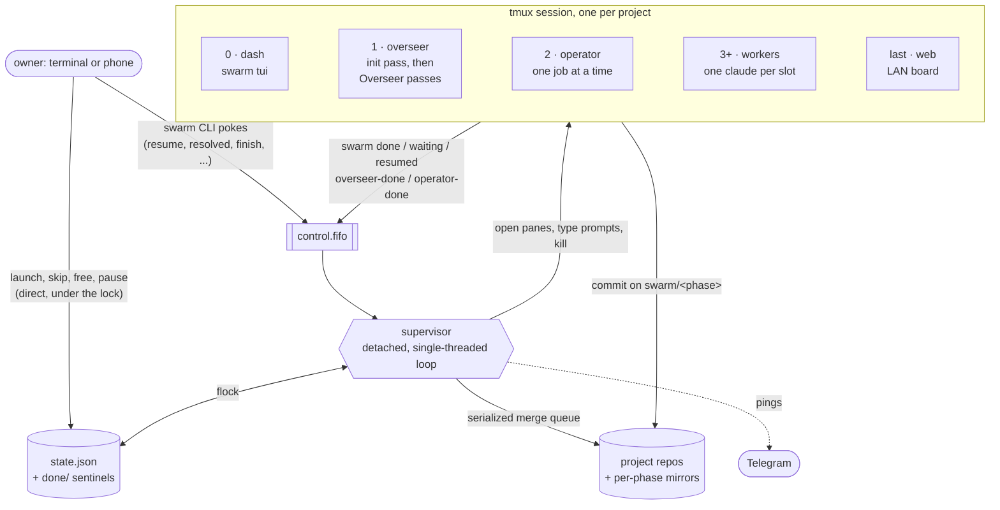
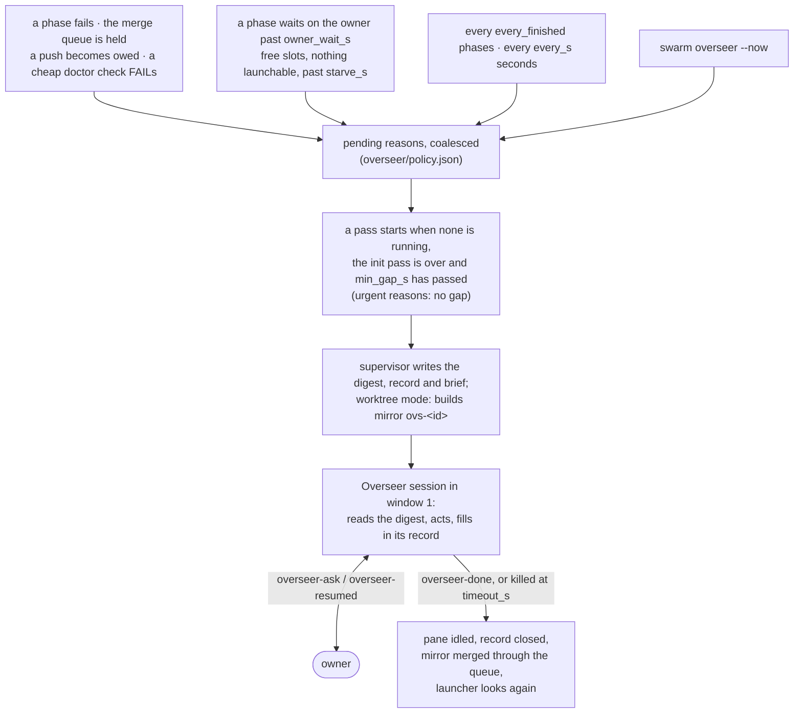
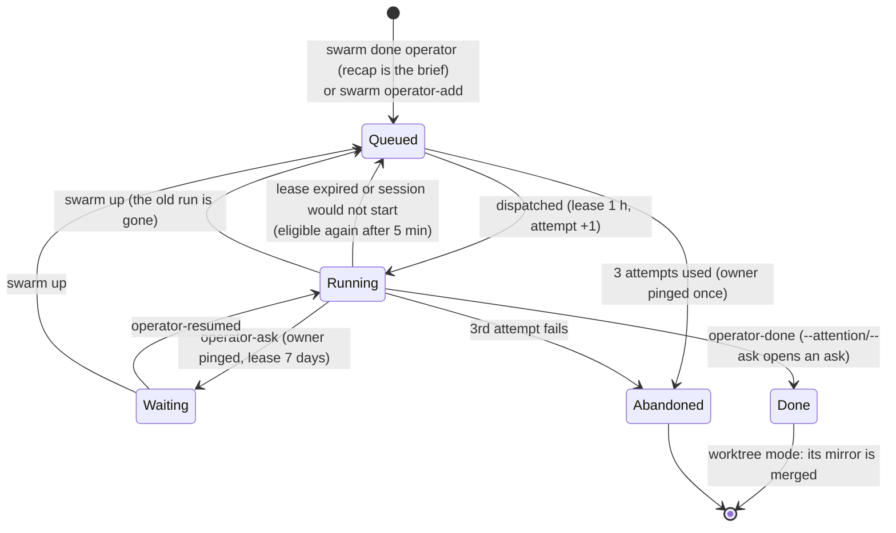
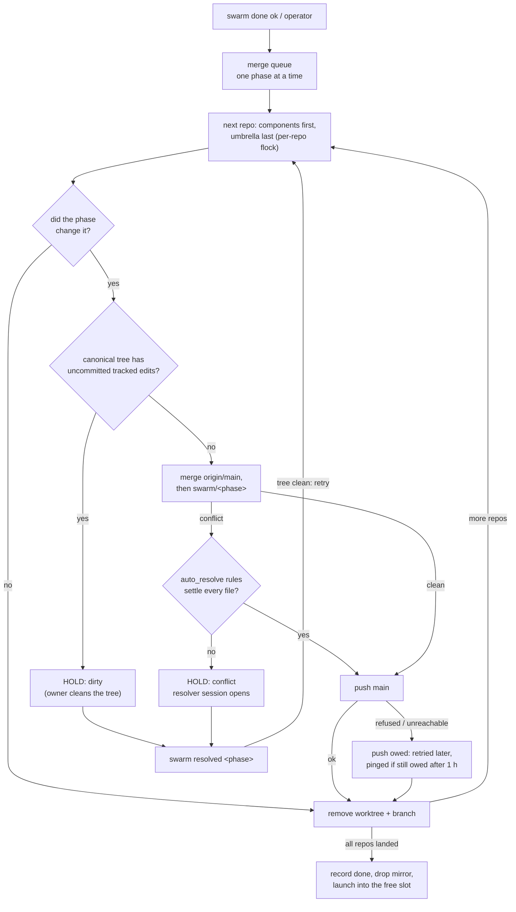
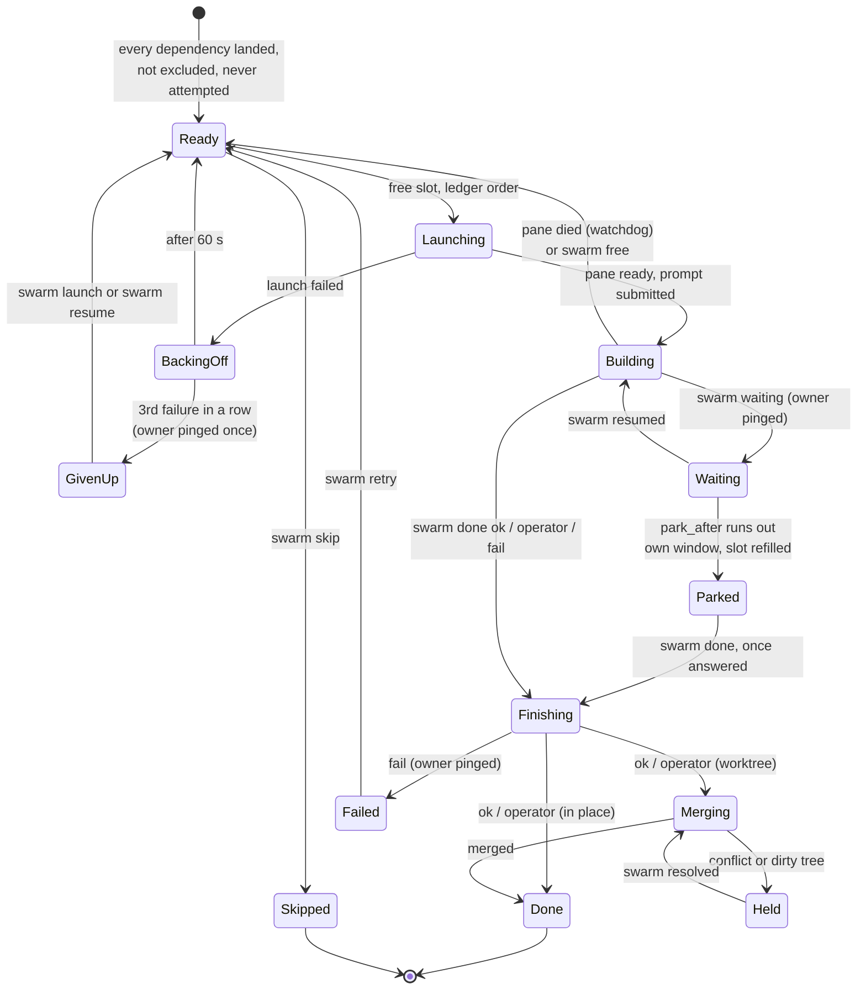

<p align="center">
  
</p>

<h1 align="center">swarm-orchestrator</h1>

`swarm` builds the phases of a project's phase ledger in parallel. It runs several
full Claude Code sessions ("workers") side by side in tmux, one phase each. A small
supervisor process launches every phase the moment its dependencies have landed.
It merges each finished phase back into the project, and pings you on Telegram
only when something needs you. Nothing in it is specific to a language or a
repository layout: it drives one repo or an umbrella of many, configured by one
`.swarm.toml`. It is aimed at multi-repo projects that build
through it every day.

<p align="center">
  
</p>

## Contents

- [What it can do](#what-it-can-do)
- [How it works](#how-it-works)
- [The cast](#the-cast)
- [A phase's life](#a-phases-life)
- [Quick start](#quick-start)
- [Answering the swarm](#answering-the-swarm)
- [Command reference](#command-reference)
- [Configuration](#configuration)
- [Runtime state](#runtime-state)
- [Tests](#tests)
- [Design principles](#design-principles)

## What it can do

- Read a phase ledger (a markdown checklist or a plain one-line format) and work
  out which phases are ready: never attempted, not ticked `[x]`, not excluded,
  every dependency landed (a ticked row counts as landed).
- Keep N Claude Code sessions busy at once. When one finishes, the next ready
  phase starts in its slot within seconds, with no model in the loop.
- Give each phase its own copy of the whole workspace (umbrella repo plus every
  component repo) on a `swarm/<phase>` branch. Two phases can then work in the
  same repo at the same time without touching each other.
- Merge finished phases back one at a time. Common conflicts (ledger ticks,
  append-only journals) are settled mechanically. A Claude resolver session is
  opened only for a real conflict. A failed push does not stop later merges.
- Stop a worker only for a genuine question. The worker pings you, asks in its
  own pane, and if you are away, moves to its own window so its slot keeps
  building something else.
- Hand leftover work (deploys, post-deploy checks, cross-repo chores) to an
  **operator** session that carries it out on your behalf.
- Give review questions a place to be answered: an **ask** opens a small session
  in its own tmux window that shows you what to look at, asks you there, and
  records your picks in the ledger rows that wait on them.
- Review the whole run every so often with an **Overseer** session. It retries
  failures, clears stuck state, reshapes the ledger when slots starve, and sends
  you a short digest.
- Cap concurrent heavy builds swarm-wide, so parallel workers cannot run the host
  out of memory.
- Show everything live: a terminal dashboard in window 0, a read-only Kanban board
  for your phone on the LAN, `swarm status`, `swarm doctor`, `swarm why <phase>`,
  and `swarm report`.
- Measure every run: phases per hour, 5-hour and weekly subscription usage per
  hour, and cost per hour. Past runs are kept in a history.
- Survive crashes. Completion is written to disk before anything else, and
  `swarm up` finishes whatever a dead run left half done and keeps its
  unfinished work for the next attempt.

## How it works

`swarm up` creates a tmux session named after the project and starts a detached
**supervisor**. The supervisor first runs one **init pass**: a Claude session in the
overseer window that checks Telegram, reads the plan, and patches your worker
command for swarm mode. As soon as the init pass idles, the supervisor launches the
ledger's ready phases, in ledger order, into the free slots. Each worker is a real
`claude` that receives `/prime <phase>` (or your `command_template`), exactly as if
you had typed it.

A worker finishes by running `swarm done <phase> ok|operator|fail "<recap>"`. That
writes a durable sentinel and pokes the supervisor through a FIFO. The supervisor
merges the work (under worktree isolation), records the phase done, and starts the
next ready phase in the freed slot. When nothing is running, ready, merging, owed
or waiting on you, the run finishes and tells you.



Slot accounting lives in `state.json`, not in tmux. Each slot is a record pinned to
a pane tagged `@swarm_slot N`, and a slot is claimed check-and-set under an
exclusive `flock`. A stray pane cannot corrupt the count, and two launches cannot
take the same slot.

## The cast

Each part in a few lines: what it is, when it runs, what it decides and what it may
not do. **[docs/components.md](docs/components.md)** has the full detail of every
part.

### Supervisor

- **Is:** one detached Python process (`swarm _supervise`). It is the only reader
  of `control.fifo`, so every event is handled in one total order. All state
  changes go through `state.json` under `flock`.
- **Runs:** from `swarm up` until the run settles, `swarm finish`, or
  `swarm down`.
- **Decides:**
  - which ready phase goes into which free slot, in ledger order, one launch
    thread each;
  - when to merge;
  - when to park a waiting worker;
  - when an Overseer pass or gc is due;
  - when the run is finished (nothing busy, waiting, parked, launching, queued,
    held or owed, and no ask open).

  A launch that fails waits 60 s before the next try. After three failures in a
  row the phase is given up and you are told once.
- **May not:** build anything, retry a phase that finished `fail`, or kill or
  restart a live worker. An error in one handler is logged, telegrammed and stepped over; it
  never ends the run silently.

### Watchdog

- **Is:** the supervisor's one periodic sweep (`[swarm].watchdog_s`, default 300 s,
  `0` = off).
- **Decides:**
  - frees a busy slot whose pane has died, after two sightings, and rolls back
    that phase's branch;
  - relaunches after a full idle interval with free slots and ready phases;
  - finishes a settled run;
  - retries owed pushes, at most every 15 minutes.
- **May not:** touch a swarm that is making progress.

### Workers

- **Are:** full Claude Code sessions, one per slot. Each is started as
  `<worker_cmd> --settings <worker_settings> --effort <effort>` in the project,
  or in its mirror. Once `claude` has booted, the supervisor types
  `/prime <phase>` (`[worker].command_template`) into the pane and checks that it
  landed.
- **Environment:** each gets `SWARM_PHASE`, `SWARM_STATE_DIR`, a private on-disk
  `TMPDIR`, and in-process teammates (so no extra panes).
- **Decide:** everything inside their phase, following the project's own worker
  command. They record small calls with `swarm note`, ask the owner the big or
  doubtful ones (`swarm waiting`), and finish with
  `swarm done <phase> ok|operator|fail "<recap>"`:
  - `ok` merges silently;
  - `operator` merges the same way and hands the recap to an operator job;
  - `fail` pings you, discards the phase's branch under worktree isolation,
    and keeps its dependents blocked.
- **May not:** push (under worktree isolation the integrator does). Nothing else
  is clamped: tools, permissions and scope are the session's own.

### Init pass and Overseer

Both run in window 1 (`overseer`), never at the same time, spawned and killed only
by the supervisor.

**The init pass** (`prompts/init_master.md`):

- **Runs:** once per `swarm up`. The first launch waits for it.
- **Does:**
  - checks Telegram via `swarm doctor`;
  - reports ledger cycles with `swarm notify`;
  - patches your worker command for swarm mode (skip the phase picker, the
    self-classified `swarm done`, `swarm build`, `note` / `waiting` / `resumed`)
    and commits it;
  - idles.
- **May not:** ask you anything, or launch phases.

**The Overseer** (`prompts/overseer.md`, `[overseer]`, on by default):

- **Is:** a full Claude session that reviews the whole run and acts on it.
- **Runs:** when triggered (diagram below). One pass at a time, at least
  `min_gap_s` apart unless the reason is urgent, and killed after `timeout_s`.
- **Reads:** a digest the supervisor writes, `<state>/overseer/digest-<id>.md`. It
  holds recaps, notes and failures since the last pass, questions waiting on you,
  a starvation map of the root blockers, and a RAM, swap and disk snapshot.
- **Decides:**
  - retries a failed phase once;
  - frees dead slots;
  - clears a hold it fixed;
  - edits the ledger so free slots have work;
  - queues operator jobs;
  - runs gc;
  - pauses the swarm when the box is in danger;
  - sends you a digest of six lines at most.

  It works in its own mirror (`ovs-<id>`) under worktree isolation, merged when
  the pass ends, and leaves a record (*Saw / Did / Left for the owner*).
- **May not:**
  - answer a worker's question;
  - restrain a worker;
  - lift a pause you made;
  - run `done`, `up`, `down` or `finish`;
  - make owner-level calls (money, taste, scope, deleting work, reversing your
    written decisions). Those go to you through `swarm overseer-ask`.



### Operator

- **Is:** one Claude session in window 2 (`operator`) that carries out work a phase
  could not wait on: deploys, post-deploy checks, provisioning, cross-repo chores
  (`prompts/operator.md`). It holds your authority, so it is **off until
  `[operator].enabled = true`**. While it is off, each hand-off is telegrammed to
  you as a to-do instead.
- **Its queue:** one JSON file per job in `<state>/operator/`. Jobs come from:
  - `swarm done … operator "<recap>"`, where the recap is the whole brief (a
    recap under 20 characters or 4 words queues nothing);
  - `swarm operator-add`;
  - `swarm operator <phase>`.
- **Triage:** a cheap model (`triage_model`) answers `now` or `later`, and
  anything odd counts as `later`. `later` means it can wait for the rest of the
  run: the job is held until nothing is building, launching, ready or merging.
  `swarm operator <phase>` by hand turns a `later` into `now`.
- **Hand-offs:** a job never opens before its phase has merged. It opens at the
  merge (unless triage said `later`), or from the queue sweep on every
  supervisor wake, oldest due job first. Only
  one job runs at a time, under a lease: 1 h, or 7 days while it waits on you. A
  job gets 3 attempts 5 minutes apart. After that it is `abandoned` and you are
  told once. Under worktree isolation it works in its own mirror (`op-<job>`),
  merged on `operator-done`. An outcome that needs you (`--attention`, or
  `--ask "<question>"` for a decision) opens an ask window where you answer, once
  the job has landed, and its one ping says what is asked and where; the rest
  reach you folded into the Overseer's summary (`[operator].notify`).
- **Decides:** how to do the job. It checks first whether the work is already
  done, narrates each action, and prefers the step it can undo.
- **May not:**
  - ask you anything except money, taste, unrecoverable data loss, or
    contradicting your written decisions (`swarm operator-ask`);
  - answer worker questions;
  - run `done`, `launch` or `finish`;
  - create branches.



### Asks

- **Is:** a Claude session in its own tmux window, `ask:<name>`, where you answer
  review questions (`prompts/ask.md`). It reads the named ledger rows and what the
  brief points at, shows you what to look at, asks with AskUserQuestion, writes
  `Owner's pick (<date>): …` into each row, ticks an `owner-run` row the answer
  completes (by the worker command file's rules and ledger gate), and ends with
  `swarm ask-done <name> "<outcome>"`.
- **Opened by:** `swarm ask --name <name> --rows <row>[,<row>…] --why "<one line>"
  "<brief>"`, run by a worker whose phase built something for you to review
  (before its own `swarm done`), by the operator or the Overseer (which notices
  `owner-run` rows that became ready with no ask open), or by you. The supervisor
  never opens one on its own: many `owner-run` rows are physical tasks.
- **Holds:** no worker slot, no timer. Several can be open at once. One ping when
  its window opens. The run does not finish while one is open, as with a parked
  phase.
- **Ends:** `ask-done` closes the window, ends everything the session started,
  stops the kept processes named with `--stop-keep`, and, under worktree
  isolation, merges its mirror `ask-<name>` through the queue. Its outcome pings
  you only with `--attention`. `swarm down` ends an ask's session; `swarm up`
  opens it again with the same brief.
- **May not:** answer for you, build what you picked, or run `done`, `launch` or
  `finish`.

### Integrator and merge-conflict resolver

- **Is:** under `isolation = "worktree"`, the supervisor's merge queue. It lands one
  phase at a time, repo by repo (components first, umbrella last), under a
  per-repo `flock`. Untouched repos are pruned with no network. A push that fails
  never holds the queue: the repo **owes a push**, you are pinged once, and it is
  retried after each integration and on the watchdog.
- **Conflicts:** a conflicted merge is first offered to `[git].auto_resolve`
  (`automerge.py`), a map from a path glob to a strategy:
  - `union` keeps both sides, for journals;
  - `keyed:<regex>` merges record by record, for ledger ticks.

  It is all-or-nothing. Only if that fails is the queue **held** and a
  **resolver** opened: a Claude session in window `resolve-<phase>`, in the
  conflicted repo (`prompts/resolver.md`).
- **The resolver may:** resolve every marker so that both sides' intent survives,
  commit, and run `swarm resolved <phase>`. If it cannot resolve correctly, it
  tells you and stops.
- **The resolver may not:** push, launch, or work outside that repo.
- **A dirty tree:** a canonical repo with uncommitted tracked edits holds the
  queue too, until you clean it and run `swarm resolved`. That command re-checks
  the repo before it releases the queue.
- **Off main:** the merge never switches your checkout's branch. One on another
  branch holds the queue until you switch back and run `swarm resolved`.
- **`fail`:** a phase that finishes `fail` is rolled back in every repo, with no
  merge. Its unmerged commits are kept under `refs/swarm-attic/` (as is anything
  else the swarm removes), for `[gc].attic_days`.



### Worktree isolation and mirrors

- **Off by default** (`isolation = "none"`): workers commit in the project itself.
- **With `isolation = "worktree"`:** each phase works in `<state>/wt/<phase>`. That
  is a worktree of the umbrella on `swarm/<phase>`, with every component repo
  (`[git].repos`, default every git repo directly under the root) nested at its
  real path on the same branch.
  - It looks exactly like the project, so two phases can build in the same repo
    at once.
  - A mirror starts from local main (or from `origin/main` when that strictly
    fast-forwards it), so your unpushed commits are kept.
  - With `[build].cache`, Rust `target/` dirs share one per-repo cache.
- **Recovery:** on `swarm up`, leftover branches are settled from the durable
  sentinels:
  - finished phases are integrated;
  - interrupted ones keep their work, saved as a commit, and their next launch
    resumes on the same branch;
  - held ones are not marked done.

### Build gate (`swarm build`)

- **Is:** a swarm-wide counting semaphore over heavy builds. At most
  `[build].max_concurrent` run at once (one `flock` per slot), and for `cargo`
  it also sets `CARGO_BUILD_JOBS` to `[build].jobs`.
- **How:** it `exec`s the build, so the build itself holds the lock, and a killed
  build frees its slot. Workers wrap their gates in it
  (`swarm build cargo nextest run`). Automatic gc takes every slot first, so it
  never runs during a build.

### Stop hook, recaps, notes, report

- **Stop hook** (`scripts/stop-hook.py`, opt-in via `worker_settings`): appends
  each worker turn's final text to `<state>/turns/<phase>.jsonl`. No API call, no
  output.
- **Recaps:** one or two sentences per phase, in `<state>/recaps/`. `swarm done`
  starts one in the background, and `swarm recap` makes one on demand. There is
  no timer. A short completion note is used as is; otherwise
  `claude -p --model haiku` writes it.
- **Notes:** `swarm note` records a decision, assumption or risk without pinging
  anyone. Your answers relayed by `resumed` / `operator-resumed` /
  `overseer-resumed` are kept as owner decisions.
- **`swarm report`:** every phase with status, timings and recap, plus warnings
  where the records disagree. `--decisions` shows only what carries a judgement
  call.

### Meters, usage and runs

- **Meters:** each worker's status line is swapped for a tap that records context
  size, session cost, and the account's 5-hour and weekly usage in
  `<state>/meters/`. It then runs your own status line, so the pane looks the
  same.
- **Runs:** a run lasts from `swarm up` to `swarm down`. `swarm reset` (or `R` in
  the dashboard) starts a new run without restarting anything, so ETA and usage
  count from now.
- **`swarm usage`:** each run's hours, phases, average 5-hour and weekly %/h,
  windows spanned, and $/h. The figures are account-wide, so other Claude sessions
  on the same account count too.
- **On your phone:** the Overseer's Telegram summary (sent on a cadence pass,
  see [Telegram](#telegram-and-asking-the-owner)) and the finish summary end with a short usage
  block (5-hour and weekly %, resets, this run's %/h, phases and $/h, and how old
  the sample is), and sending `/usage` to the swarm bot answers with the same block.

### Doctor, why, gc

- **`swarm doctor`:** about 25 read-only checks covering the supervisor, slots,
  the run, integration, questions and asks waiting on you, the ledger, Telegram, disk,
  records, the operator, prompts, the web board and the bot's command listener.
  Exit 1 on any FAIL.
- **`swarm why <phase>`:** the one reason a phase is not running, walking unmet
  dependencies to the root blockers.
- **`swarm gc`:** reclaims disk. It is a dry run unless you pass `--yes`.
  - **Always planned:** caches of repos that no longer exist, `incremental/`,
    superseded cargo units, `cargo sweep` past `keep_days`, orphan mirrors,
    stale temp dirs.
  - **Opt-in:** `--aggressive`, `--transcripts`, `--branches`, `--canonical`.
  - **Safety:** it holds every build slot while it deletes.
  - **Automatic:** the supervisor runs it by itself (`[gc]`): every 15 minutes,
    plus once per idle stretch.

### Dashboard (`swarm tui`)

A Textual app in window 0. It has a status bar (live, paused or down; slots;
campaign progress; time since the last event) and a needs-you drawer (`n`). Its
eleven tabs, switched with `1`–`9`, `0` and `a`, are:

- **home:** ETA, usage outlook, working now, and a feed;
- **workers**;
- **history**;
- **alerts:** Telegram sends, and the messages held back (`·`);
- **disk**;
- **settings:** edits `.swarm.toml` and runs `swarm reload`;
- **commands:** every subcommand, with a confirmation for the destructive ones;
- **doctor**;
- **runs**;
- **shells** (`0`): what `swarm keep` left running, and why;
- **asks** (`a`): what waits on you in an ask window, and how to get there.

`R` resets the run and `q` quits the dashboard only. It fits an 80×24 terminal.

### Web board (`swarm web`)

- **Is:** a read-only Kanban board for a phone on the LAN, in the last tmux
  window. `swarm status` prints its address.
- **Columns:** Needs you, Blocked, Ready, Building, Merging / held, Operator,
  Done, Failed, Excluded.
- **Waiting on you:** the open asks (rows, what you decide, how to reach the
  window), read-only, at the top of the activity view.
- **Views:** campaign swimlanes, an activity view of Overseer passes and
  finishes, a detail sheet per card (`#phase=<id>`), and live updates over
  Server-Sent Events.
- **Safety:** GET only, no URL maps to a file, and credential-shaped strings are
  redacted. It is **open on the LAN with no token**, by design. See
  [docs/components.md](docs/components.md#the-web-board-swarm-web) for the WSL
  firewall rule.

### Processes and `swarm keep`

- **Everything dies with its session.** Every session carries
  `SWARM_SESSION_ID=<kind>:<id>` and hands it to all it starts. When a worker's
  `swarm done` lands (or the watchdog finds it dead), an operator job ends, an
  Overseer pass ends or a resolver is closed, the supervisor ends every process
  still carrying it, detached ones (`setsid`, `nohup`) included: HUP, TERM, then
  KILL, like `swarm down`.
- **`swarm keep` is the exception**, for something the owner needs after the
  session is gone, and only then:
  `swarm keep --name N --why "<one plain line>" -- <command…>`. It runs detached
  with the session's markers stripped, so it outlives its session and
  `swarm down`, and is listed by `swarm keep --list`, `swarm status`,
  `swarm doctor` (a warning past 7 days) and the dashboard until
  `swarm keep --stop N`. The session names it in its recap or outcome.
  Details: [components.md](docs/components.md#processes-everything-dies-with-its-session-swarm-keep-is-the-exception).

### Telegram, and asking the owner

- **The sender:** the swarm has its own bot, `scripts/notify.sh`. It reads
  `TELEGRAM_BOT_TOKEN` and `TELEGRAM_CHAT_ID` from this repo's gitignored `.env`.
  Every send is logged to `<state>/notifications.jsonl`. `swarm notify` is the
  only way a session should message you, even when a brief or a ledger row
  names another script (a `notify.sh`, say); the prompts say so.
- **What pings you** (`[telegram].pings = "necessary"`, the default): only what
  needs you.
  - a question from a worker, the operator or the Overseer;
  - an ask whose window opened (once per ask);
  - a merge hold you must clear: a dirty tree, or a conflict no resolver could
    start (a resolver that cannot fix one messages you itself);
  - an operator outcome flagged `--attention`, an abandoned job, or a to-do
    while the operator is off;
  - a `fail` after the Overseer's retry, or any `fail` while the Overseer is off;
  - a push still owed after `push_owed_grace_s` (1 h), and then its clearing;
  - a phase that would not start (once per phase), a launch given up, a worker
    that died without `swarm done`;
  - a supervisor crash or error; a master that would not start, or an Overseer
    pass that failed or ran long, three times in a row;
  - the Overseer's summary on a cadence pass (`every_finished`) or one you asked
    for, or any summary it flags `--attention`;
  - a note from the init pass or a resolver (`swarm notify`);
  - the finish summary, with the usage block.
- **Logged, not sent:** routine operator outcomes, parks, a first `fail` (the
  Overseer retries it), a push owed for less than the grace, a conflict a
  resolver is working on, a web board that did not start, a single master or
  Overseer failure, a repeat failed start, and the summary of any other Overseer
  pass. Each is still in `notifications.jsonl` (marked `suppressed`), on the
  dashboard's alerts tab (as `·`), and in the Overseer's digest where it applies.
  `[telegram].pings = "all"` sends every one of them again. `ok` finishes are
  silent either way.
- **Commands:** the bot also listens. Send it `/usage` for the usage block or
  `/help` for the list. `swarm up` starts the listener (`[telegram].commands`, on
  by default), `swarm down` stops it, and `swarm telegram-bot` runs it in the
  foreground. It answers only the chat in `TELEGRAM_CHAT_ID` and ignores everyone
  else. Only one program may poll a bot token: while it runs,
  `scripts/resolve-chat-id.sh` gets a 409, so run that before `swarm up`.
- **Asking:** a worker runs `swarm waiting` / `resumed`, the operator runs
  `operator-ask` / `operator-resumed`, and the Overseer runs `overseer-ask` /
  `overseer-resumed`. Each pings you, asks in its own pane, and records your
  answer (see [Answering the swarm](#answering-the-swarm)).

### Reload, layout, check

- **`swarm reload`:** applies a `.swarm.toml` edit live. Each key is *hot*
  (applied now), *next* (reaches the next session launched) or *restart*
  (refused). A file that does not parse changes nothing.
- **`swarm layout <name>`:** re-arranges the worker panes live (`auto`,
  `side-by-side`, `top-bottom`, `tiled`, …). Each worker window holds at most
  `[tmux].panes_per_window` panes (4 by default); more slots page into
  `workers-2`, `workers-3`, …, so 5 workers at 2 per window are 2, 2 and 1.
- **`swarm check`:** a preflight covering the Telegram sender, the ledger, and
  **promptlint**. Promptlint flags sentences in your worker command or the
  shipped prompts that the code has made false (for example a subcommand that
  does not exist), and measured time-wasters (`sleep` loops, status polling).

## A phase's life



- **Done and skipped** both release a phase's dependents. **Failed** does not: its
  work was rolled back, so nothing may build on top of it, and it stays out of
  `ready` until `swarm retry` clears it (`--cascade` also resets dependents that
  had already run).
- **Waiting and parked** phases keep the run open until they finish, and so does
  an open ask.
- **Pause:** `swarm pause` holds new launches while running workers finish.
- **Done-ness** comes from the swarm's own records (`state.json`, seeded from
  `done/` sentinels on every `swarm up`), plus the ledger's checkboxes: a row
  ticked `[x]` that the swarm has no record of counts as done. It is neither
  launched nor holds back its dependents, exactly as the web board shows it. It
  is only a reading of the ledger, never written to the records, so a record
  always wins: a ticked row the swarm recorded `fail` stays failed until
  `swarm retry`, and a tick on a phase still in flight releases nothing until it
  lands.

## Quick start

**Requirements:** Linux, Python 3.12+, [uv](https://docs.astral.sh/uv/), tmux,
git, and the `claude` CLI logged in. `cargo-sweep` is optional, for gc.

1. **Install:**

   ```bash
   uv tool install --editable ~/Projects/swarm-orchestrator   # puts `swarm` on PATH
   ```

2. **Set up Telegram** (optional; the swarm runs without it): create a bot, put
   `TELEGRAM_BOT_TOKEN=…` in this repo's `.env`, send the bot any message, then run
   `scripts/resolve-chat-id.sh`.

3. **Have a phase ledger** in the project, at `docs/PHASE-LEDGER.md` by default.
   Either format works:

   ```markdown
   - [ ] `db-P1` · needs:`db-P0` · the schema
   - [ ] `api-P3` · needs:`db-P1` `api-P2` · the REST surface
   ```

   ```text
   db-P1 needs:db-P0
   api-P3 needs:db-P1,api-P2   optional note
   ```

   In the markdown form, only checklist items are phases. The first backticked
   token is the id, and the back-ticked ids in the `needs:` field (fields are
   separated by ` · `) are its dependencies. Tokens that are not phase ids, such
   as git tags, are ignored.

   **A ticked row `- [x]` counts as built:** the swarm will not launch it, and
   its dependents are free to start. Tick the rows that are already built (or
   `swarm skip` them; the bare format has no checkboxes, so there `swarm skip`
   is the only way).

4. **Have a worker command:** a Claude Code slash command that builds one phase
   given its id. It is `/prime <phase>` by default, in
   `.claude/commands/prime.md`. The init pass adapts it for swarm mode on the
   first `swarm up`. Every change is guarded by `$SWARM_PHASE`, so running it by
   hand stays interactive.

5. **Add `.swarm.toml`** at the project root. A minimal one:

   ```toml
   [swarm]
   max_workers = 2

   [git]
   isolation = "worktree"   # omit for in-place work
   ```

   [`examples/multi-repo.swarm.toml`](examples/multi-repo.swarm.toml) is a fuller
   example, and [docs/config.md](docs/config.md) lists every key.

6. **Check and run:**

   ```bash
   cd your-project
   swarm check           # telegram, ledger, prompt lint
   swarm up              # session + supervisor + init pass, then attaches you
   ```

**Moving around:** `Ctrl-b 0` is the dashboard, `1` the overseer window, `2` the
operator, `3` the first workers window (`4`, … page through the rest), and the
last window is the web board; an ask's window, `ask:<name>`, opens after it.
`Ctrl-b d` detaches while the supervisor keeps
running. Inside tmux already, `swarm up` switches your client instead of
attaching; `swarm up --no-attach` is for scripts.

**Stopping:** `swarm down` stops the supervisor. It then ends every session
process the run started (SIGHUP, then SIGTERM, then SIGKILL), kills the tmux
session, and prints the run's summary.

## Answering the swarm

A worker stops only when a call is genuinely yours, or when it is in doubt about
something that matters. Small, cheap-to-change calls it makes itself and records
with `swarm note`. When it does need you:

1. It runs `swarm waiting "$SWARM_PHASE" "<question>"`, which telegrams you the
   question with its cost line.
2. It asks the same question in its own pane with AskUserQuestion.
3. You switch to its window and answer there.
4. It runs `swarm resumed "$SWARM_PHASE" "<your answer>"`. Your answer is saved
   as an owner decision, and any pending park is cancelled.

If you have not answered within `[worker].park_after` seconds (default 120), the
supervisor **parks** the worker:

- a fresh pane takes its place in the grid;
- the live worker moves to its own `wait:<phase>` window;
- the next ready phase starts in the freed slot.

The parked worker keeps waiting for you. Its dependents stay blocked, and the run
cannot finish until you answer and the worker runs `swarm done`.

The operator (`operator-ask` / `operator-resumed`) and the Overseer
(`overseer-ask` / `overseer-resumed`) work the same way. Asking stretches their
lease or timeout to 7 days, so a question left overnight does not kill them. The
init pass never asks.

**Review questions have their own window.** When a phase builds something for you
to look at (mockups, a page) and your decision lives in `owner-run` rows that no
worker builds, the worker does not wait for you: it opens an **ask** and finishes.
You get one ping:

```
swarm: coral-W1, coral-W2 wait on you: answer in tmux window ask:coral (`tmux attach -t myproject`)
the owner picks the Settings and Home layouts
```

1. `tmux attach -t <session>`, then `tmux select-window -t <session>:ask:<name>`
   (or `Ctrl-b w` and pick `ask:<name>`).
2. The session there tells you what to look at and asks you with AskUserQuestion.
   Answer there; take as long as you like, it never times out.
3. It writes your picks into the rows, ticks the ones your answer completes, and
   closes its window with `swarm ask-done`. The rows' dependents can then start.

`swarm ask --list`, `swarm status`, `swarm doctor`, the dashboard's asks tab (`a`)
and the web board's "Waiting on you" list all show what waits on you. You can open
one yourself with `swarm ask`, and `swarm ask --reopen <name>` brings back a window
that was closed.

## Command reference

The full list, one line per subcommand and grouped by purpose, is in
**[docs/cli.md](docs/cli.md)**. The ones you will type most:

| you want to | run |
|---|---|
| start, watch, stop | `swarm up`, `swarm status`, `swarm down` |
| see what is wrong | `swarm doctor`, `swarm why <phase>` |
| hold or release launching | `swarm pause`, `swarm resume` |
| start a phase by hand, skip one, retry a failure | `swarm launch <phase>`, `swarm skip <phase>`, `swarm retry <phase>` |
| release a held merge queue | `swarm resolved <phase>` |
| apply a config edit | `swarm reload` |
| see what was done and what it cost | `swarm report`, `swarm usage` |
| free disk | `swarm gc`, then `swarm gc --yes` |
| leave something running past its session, see it, stop it | `swarm keep --name N --why "…" -- <cmd>`, `swarm keep --list`, `swarm keep --stop N` |
| ask the owner to review something, see what waits on them | `swarm ask --name N --rows R --why "…" "<brief>"`, `swarm ask --list` |

## Configuration

`.swarm.toml` at the project root. The sections are:

- `[swarm]`: slots, models, the watchdog;
- `[worker]`: the worker command, settings, effort, parking;
- `[tasks]`: the ledger, exclusions;
- `[telegram]`;
- `[tmux]`: the session name, the layout, worker panes per window;
- `[tui]`;
- `[git]`: isolation, main branch, repos, `auto_resolve`;
- `[build]`: the gate, the jobs cap, the target cache;
- `[operator]`;
- `[ask]`: the model of an ask session;
- `[overseer]`: triggers, timeout;
- `[gc]`;
- `[web]`.

Every key, with its default, its environment override and its reload class, is
in **[docs/config.md](docs/config.md)**.

## Runtime state

State lives outside the project, under
`~/.local/state/swarm-orchestrator/<folder>-<hash>/`. The hash is of the full
project path, so two projects with the same folder name never share state.
`SWARM_STATE_DIR` overrides the location.

| path | what it holds |
|---|---|
| `state.json` (+ `.lock`) | Slots, the done map, the merge queue, holds, owed pushes, waiting and parked phases, the operator lease, the live Overseer pass, the run id. Every write is under `flock`. |
| `control.fifo` | The supervisor's one input. |
| `config.json` | The config the running supervisor loaded (what `swarm reload` diffs against). |
| `done/<phase>.<status>`, `done/<phase>.jsonl` | Durable completion sentinels, and every `swarm done` attempt. |
| `operator/<job>.json`, `.brief.md`, `run.id` | The operator queue. |
| `overseer/` | `policy.json` (trigger memory), `digest-<id>.md/.json`, pass records `<id>.md/.json`, briefs. |
| `notes/<phase>.jsonl` | Decisions, assumptions, risks, and owner answers. |
| `turns/<phase>.jsonl` | Final turn texts from the Stop hook. |
| `recaps/<phase>.json` | Generated recaps. |
| `meters/` | Per-phase meters, `limits.jsonl` (5-hour and weekly samples), `sessions.jsonl`. `limits.jsonl` is not rotated: a row is written only when a usage figure moves (a few hundred small rows a day at most), the open run's usage is computed from every sample since its start, and each closed run keeps its own slice in `history/runs/<id>/`. |
| `history/` | `current.json` and `runs/<id>/` (runs and their summaries). |
| `notifications.jsonl` | Every Telegram send and whether it landed, plus every message held back on purpose (`suppressed`). |
| `logs/supervisor.log`, `logs/web.log`, `logs/telegram-bot.log` | Logs. The supervisor log rotates at 16 MiB, keeping three old files (`supervisor.log.1`, newest, to `.3`); `swarm report`, `swarm usage`, the run history and the dashboard read the old files too. `web.log` and `telegram-bot.log` are not rotated. |
| `wt/<name>/` | Worktree mirrors (`<phase>`, `op-<job>`, `ovs-<id>`, `ask-<name>`). |
| `git/<repo>.lock`, `buildsem/slot<N>` | Per-repo integration locks, build-gate slots. |
| `cache/target/<repo>/` | The shared cargo target cache. |
| `ask/<name>.json`, `ask/<name>.brief.md` | Each ask: its rows, why, brief, who opened it, whether it is open or done (and its outcome), whether its one ping went. `swarm up` opens every open one again from here. |
| `keep/<name>.json`, `keep/<name>.log` | What `swarm keep` left running: pid, start time, argv, cwd, who started it, why; and its output. |
| `tmp/<session>/` | Each session's `TMPDIR`. It is on disk because `/tmp` may be RAM, and it is dropped when the session's work lands. |
| `web.pid`, `gc-auto.json`, `.doctor-disk.json` | The board's pid, the last automatic gc, doctor's disk-growth baseline. |
| `telegram-bot.pid`, `.offset.json`, `.status.json` | The command listener's pid, the next Telegram update id it will ask for, and what it is doing (polling, backing off a 409, …). |

## Tests

```bash
uv run pytest
```

About 2,000 tests, hermetic and LLM-free. They run a real supervisor against fake
master and worker shell scripts (`examples/demo/`), in throwaway git repos,
throwaway tmux sessions and temp state dirs, with no `claude` and every model
call replaced by an environment seam. Everything is torn down in `finally`. The
fake scripts need bash (`read -t`).

**Tiers:**

- lifecycle (`test_lifecycle.py`, `test_launcher.py`, `test_park.py`,
  `test_recovery.py`);
- real tmux mechanics (`test_selftest.py`, `test_inject.py`);
- git (`test_worktree.py`, `test_multirepo.py`, `test_automerge.py`,
  `test_push_owed.py`);
- operator and Overseer (`test_opqueue.py`, `test_opsession.py`,
  `test_overseer_*.py`), and asks (`test_ask.py`);
- the dashboard, which is booted headless at three terminal sizes (`test_tui_*.py`);
- the web board (`test_web_*.py`);
- the usage block and the bot's command listener (`test_tgbot.py`);
- units for every other module.

## Design principles

These are the owner's rules, and the code follows them.

- **Pure injection, minimal lifecycle.** The supervisor reacts to events. Its only
  timed wakes are:
  - a waiting worker's park deadline;
  - a failed launch's back-off (60 s, 3 tries);
  - the watchdog sweep (`watchdog_s`, off at `0`);
  - the Overseer's cadence and timeout;
  - the operator queue's lease and back-off;
  - automatic gc;
  - owed-push retries.

  There are no retry loops, safety timers or re-derivation backstops beyond
  these. A `fail` is final until someone runs `swarm retry`. A live worker is
  never killed or restarted. Only a worker whose pane has already died is
  cleared, and its phase goes back to ready.
- **Workers are full, unrestrained Claude sessions** with a clear directive. Their
  tools, permissions and scope are never clamped. The swarm shapes the ledger,
  the prompt and the environment, never the worker.
- **Decide the small, ask the big.** Sessions make cheap, reversible calls
  themselves and record them with `swarm note`. They ask the owner (a Telegram
  ping, then AskUserQuestion in their pane) for money, taste, scope, irreversible
  changes, contradicting a written decision, or whenever they are in doubt about
  something that matters. They never guess an answer that is the owner's, and
  never answer a question for the owner.
- **Durable before visible.** A sentinel is written before any poke, and an
  operator item before the merge it depends on. Recovery works from those records,
  never from branch shape, and nothing is reported done that did not land.
- **One writer, total order.** One FIFO reader, one lock over the state, one merge
  at a time.

**Accepted trade-off:** a worker that received its prompt and then stalls,
alive but silent, is not detected by the supervisor. Its pane is alive, so the
watchdog leaves it alone. `swarm doctor` flags a busy slot with no edits or
commits 20 minutes after launch, and the dashboard shows the time since the last
event. Freeing or relaunching such a slot is the owner's call.
