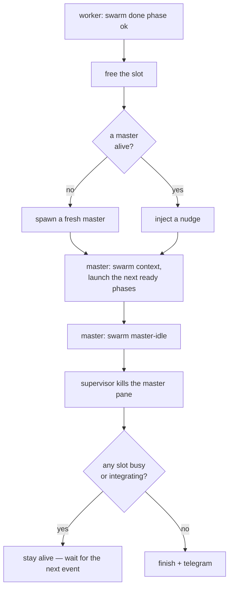
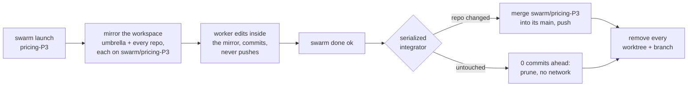

# swarm-orchestrator

Run a swarm of `claude` (Claude Code CLI) sessions in tmux to build a project's
**phases** in parallel — one ephemeral *master* that decides what to launch, four
fixed *worker* slots that build, and a single long-running *supervisor* that owns
the whole lifecycle through one FIFO. It is pure glue over tmux and the `claude`
CLI, so it drives projects in **any language**, configured by a per-project
`.swarm.toml`.

<p align="center">
  
</p>

## How it works

`swarm up` builds a tmux session with a **master** window (one pane) and a
**workers** window of four tiled slots, starts a detached **supervisor**, and
launches an **init master**. The master reads your phase ledger, works out which
phases are ready, and `swarm launch`es up to four into the slots — each a real
`claude` running `/prime <phase>`. When a worker finishes it calls `swarm done`;
the supervisor spawns a fresh master (or nudges the live one) to launch the next
ready phase into the freed slot. It loops until nothing is left, then telegrams
you.

Slot accounting is **state-based**, not pane-counting: four fixed pane ids tagged
`@swarm_slot N`, claimed check-and-set under `flock(state.json)`. A stray teammate
pane can't corrupt the count, and two launches can't grab the same slot.

## The lifecycle — four rules, no safety net

The supervisor is the **sole** FIFO reader (so every event is totally ordered),
the sole writer of `state.json`, and the sole killer of the master pane. It runs
exactly four rules — no redo, no reconcile pass, no safety timer, no crash
watchdog, no auto-retry:

1. **`done <phase> <ok|fail>`** — free the slot; if no master is alive, **spawn**
   one, otherwise **inject** a one-line nudge into the live one.
2. **`master-idle`** — kill the master pane.
3. After a kill — **finish** (teardown + telegram) once no slot is busy *and*
   nothing is integrating.
4. A worker that fails a gate **parks** (emits no `done`), so its slot stays busy
   and finish can't fire until you resolve it.



Pure injection has no backstop, on purpose. If tmux ever drops an injected
keystroke, that slot's next phase waits for the following `done` and self-heals;
if it was the *last* worker, `finish` fires with the ready phase logged so you can
`swarm launch` it by hand.

## Install

```bash
uv tool install --editable ~/Projects/swarm-orchestrator   # puts `swarm` on PATH
```

## Get started

1. **Add a `.swarm.toml`** to your project root — copy
   [`examples/multi-repo.swarm.toml`](examples/multi-repo.swarm.toml) and trim it.
2. **Give the worker command a completion hook.** The command in
   `[worker].command_file` (e.g. `.claude/commands/prime.md`) must, *when
   `$SWARM_PHASE` is set*, (a) skip any "which phase?" prompt and build
   `$SWARM_PHASE` directly, and (b) run `[worker].done_hook`
   (`swarm done "$SWARM_PHASE" ok`) once the phase is green. On the first
   `swarm up` the init master proposes those two edits for you to approve — or add
   them yourself.
3. **Run it** from the project root (or pass `--project-dir`):

```bash
cd your-project
swarm up          # session + supervisor + init master, then attaches you
```

`swarm up` drops you straight into the tmux session — `Ctrl-b 0` is the master,
`Ctrl-b 1` is the four workers, `Ctrl-b d` detaches (the supervisor keeps
running). Already inside tmux? it switches your client to the session. Scripting
it? `swarm up --no-attach`. Tear everything down with `swarm down`.

## Answering the swarm

A worker stops for you only when it genuinely needs a decision — it telegram-pings
first, then asks in its own pane. Switch to the workers window and answer there.
The master's questions (confirm the first batch, approve the `prime.md` diff) show
in the master window. Everything else runs unattended.

## Commands

| command | what it does |
|---|---|
| `swarm up [--no-attach]` | build the session, start the supervisor + init master, then attach |
| `swarm down` | stop the supervisor and tear the session down |
| `swarm status` | human-readable state dump — slots, `done`, `paused`, the integration queue |
| `swarm context` | the JSON snapshot the master reasons over (ready set, free slots, ledger issues) |
| `swarm pause` / `swarm resume` | hold new launches (in-flight finish) / resume filling free slots |
| `swarm launch <phase>` | claim a free slot and start a phase by hand |
| `swarm done <phase> [ok\|fail] [note]` | signal phase completion — what a worker calls |
| `swarm skip <phase>` | mark a phase done without building it |
| `swarm free <slot\|phase>` | free a stuck slot (by id or phase) |
| `swarm resolved <phase>` | after you clear a held integration (conflict / dirty tree / push failure) |
| `swarm integrate <phase>` | manually integrate `swarm/<phase>` into main (worktree mode) |
| `swarm finish` | ask the supervisor to stop now |

`swarm bootstrap` and `swarm master-idle` are low-level FIFO pokes the tooling
sends for you; you rarely type them.

## Worktree isolation (opt-in)

By default (`isolation = "none"`) workers commit in place, and you keep them from
colliding with the phase dependency graph. Opt into `isolation = "worktree"` and
each phase instead builds against a **full, isolated mirror of the whole
workspace** on branch `swarm/<phase>`: a worktree of the project (the *umbrella*)
with a worktree of every component repo nested inside it at its real path. The
worker's cwd looks exactly like the real project — `cd pricing` just works — but
nothing it does touches the canonical repos or another phase's mirror. Which repos
are mirrored is set by `[git].repos` globs (default: every git repo that is a
direct child of the project root).

This suits a **monorepo-of-repos**: an umbrella repo whose tracked files (docs,
deploy config) every phase edits, gitignoring independent component repos where
the code lives. Because each phase gets its own worktree per repo, **two phases
may build in the same repo at once** — there is no per-repo launch gate.



On `swarm done ok` a single serialized integrator (under a per-repo `flock`)
merges every repo the phase changed and pushes; repos it didn't touch are 0
commits ahead and are pruned with no network. A `swarm done ... fail` rolls back
**every** repo — all worktrees and branches removed, no merge. Integration is
idempotent and resumable, so a crash mid-run is reconciled on the next `swarm up`
**from the durable `done` sentinels**: an interrupted phase (no `ok` sentinel) is
discarded and rebuilt, never silently marked done.

The merge-queue never wedges on a clean tree — it distinguishes four outcomes:

| outcome | meaning | what happens |
|---|---|---|
| **merged** | clean, pushed, pruned | slot advances |
| **conflict** | a repo left mid-merge | resolver pane opens on that repo; `swarm resolved <phase>` finishes it |
| **dirty** | a repo's canonical tree has *tracked* uncommitted changes | queue held; commit/stash, then `swarm resolved <phase>` |
| **push_failed** | merged locally, remote unreachable | queue held; fix connectivity, then `swarm resolved <phase>` |

A git error or a hung remote can't crash the sole supervisor — it degrades to a
hold. (Untracked files never count as dirty; they don't block a clean merge.)

## Config (`.swarm.toml`)

```toml
[swarm]
max_workers  = 4
master_model = ""                 # "" = inherit; else "opus" / "sonnet" / ...

[worker]
command_template = "/prime {phase}"           # sent via send-keys into each slot
command_file    = ".claude/commands/prime.md" # init master inspects/patches this
env_marker      = "SWARM_PHASE"
done_hook       = 'swarm done "$SWARM_PHASE" ok'
worker_settings = '{"teammateMode":"in-process"}'  # worker teammates run in-process

[tasks]
ledger  = "docs/PHASE-LEDGER.md"   # the master reads this prose directly
roadmap = "docs/ROADMAP-MASTER.md"
exclude = []                        # externally-blocked phases

[telegram]
notify = "/path/to/swarm-orchestrator/scripts/notify.sh"

[tmux]
session = "swarm"

[git]                               # omit the block for isolation = "none"
isolation   = "worktree"
main_branch = "master"
repos       = ["*"]                 # component repos to mirror; e.g. ["*", "packages/*"]
```

The ledger is prose the LLM master reads directly. For deterministic gating (and
the tests) it also understands one line format — `P4 needs:P1,P2` — and flags a
dependency cycle, self-dependency, or unknown dependency in `swarm context` rather
than stalling on it silently.

## Runtime state

State lives outside the repo, under
`~/.local/state/swarm-orchestrator/<project-slug>/` — `state.json`,
`control.fifo`, `done/` (durable completion sentinels), `logs/`, and, in worktree
mode, `wt/` (the per-phase mirrors) and `git/` (per-repo integration locks). The
slug includes a hash of the full project path, so two projects that share a folder
name never share state.

## Tests

Hermetic and LLM-free: a **real supervisor** against **fake** master/worker shell
scripts, throwaway git repos, a throwaway tmux session, and temp dirs — no
`claude`, all torn down in `finally`.

```bash
uv run pytest
```

- **Lifecycle** (`test_lifecycle.py`) — the state machine, FIFO/sentinel plumbing,
  dep gating, fan-out, injection, convergence, parked-worker deadlock-freedom, and
  a best-effort `done` that never hangs.
- **Worktree** (`test_worktree.py`) — real-git integrate, the ledger different-line
  race, conflict block-and-resolve, push-failure vs conflict, dirty-tree hold,
  resolvable push-time conflict, sentinel-driven reconcile.
- **Multi-repo** (`test_multirepo.py`) — repo discovery + globs, the nested
  workspace mirror, concurrent same-repo phases, untouched-repo no-ops, full
  rollback, and the supervisor lifecycle guards.
- **Unit** (`test_state.py`) — slot claim, `flock` under real concurrency, the
  dependency resolver, config validation, the FIFO line format.

The fake scripts require **bash** (`read -t`); on the target host `/bin/sh` is
dash and lacks it.

## Accepted design trade-off

Pure injection has no safety net — the owner's explicit call. If an injected
keystroke is ever lost (a tmux `send-keys` phenomenon; the bare-pipe path in tests
is reliable), that slot's next phase waits until the following worker finishes and
self-heals on the next `done`; if it was the *last* worker, finish fires with the
ready phase logged (`FINISH-WITH-READY`) so you can `swarm launch` it by hand.
