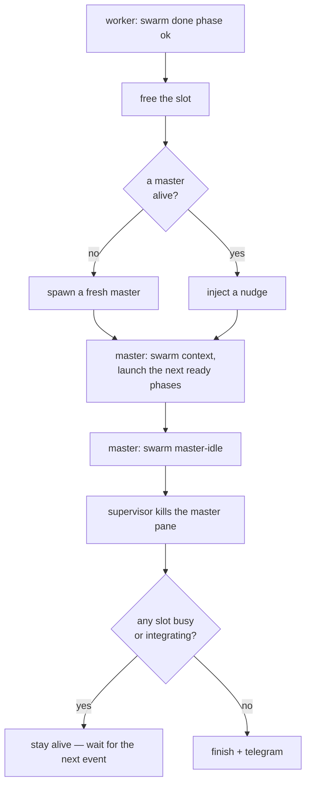
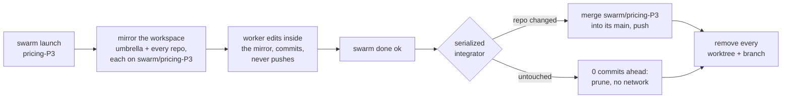

# swarm-orchestrator

Run a swarm of `claude` (Claude Code CLI) sessions in tmux to build a project's
**phases** in parallel — one ephemeral *master* that decides what to launch, a
configurable pool of *worker* slots (`[swarm].max_workers`) that build, and a
single long-running *supervisor* that owns the whole lifecycle through one FIFO.
It is pure glue over tmux and the `claude` CLI, so it drives projects in **any
language**, configured by a per-project `.swarm.toml`.

<p align="center">
  
</p>

## How it works

`swarm up` builds a tmux session with a **master** window (one pane) and one or
more **workers** windows holding `[swarm].max_workers` slots, paginated into
windows of at most four (`workers`, `workers-2`, …), arranged by `[tmux].layout`
— the default `"auto"` gives a lone slot its whole window, splits two LEFT|RIGHT,
and tiles three–four into a grid; pin `"top-bottom"` (or any tmux preset) to
stack them instead, or flip it live with `swarm layout`. It starts a detached
**supervisor** and launches an **init master**. The master reads your phase
ledger, works out which phases are ready, and `swarm launch`es as many as there
are free slots — each a real `claude` running `/prime <phase>`. When a worker
finishes it calls `swarm done`; the supervisor spawns a fresh master (or nudges
the live one) to launch the next ready phase into the freed slot. It loops until
nothing is left, then telegrams you.

Slot accounting is **state-based**, not pane-counting: `max_workers` pane ids
tagged `@swarm_slot N` across a global index, claimed check-and-set under
`flock(state.json)`. A stray teammate pane can't corrupt the count, and two
launches can't grab the same slot.

## The lifecycle — the supervisor's rules

The supervisor is the **sole** FIFO reader (so every event is totally ordered),
the sole writer of `state.json`, and the sole killer of the master pane. It is
event-driven — no redo, no reconcile pass, no crash watchdog, no auto-retry; its
only timed wake is a park deadline a `waiting` worker armed (rule 5):

1. **`done <phase> <ok|operator|fail>`** — free the slot; if no master is
   alive, **spawn** one, otherwise **inject** a one-line nudge into the live one.
   (`ok`/`operator` integrate the work; `fail` rolls it back.)
2. **`master-idle`** — kill the master pane.
3. After a kill — **finish** (teardown + telegram) once nothing is `pending`
   *and* nothing is integrating.
4. Anything in flight keeps the run `pending` so finish can't fire early — a busy
   slot, a worker `waiting` on you, or a `parked` worker.
5. **`waiting <phase>`** — a worker needs you. After `[worker].park_after` with no
   answer it's moved alive into its own `wait:<phase>` window and its slot is
   freed for a replacement; it stays `pending` until you answer and it runs `done`.



Pure injection has no backstop, on purpose. If tmux ever drops an injected
keystroke, that slot's next phase waits for the following `done` and self-heals;
if it was the *last* worker, `finish` fires with the ready phase logged so you can
`swarm launch` it by hand.

## Install

```bash
uv tool install --editable ~/Projects/swarm-orchestrator   # puts `swarm` on PATH
```

## Get started

1. **Add a `.swarm.toml`** to your project root — copy
   [`examples/multi-repo.swarm.toml`](examples/multi-repo.swarm.toml) and trim it.
2. **Let the init master patch the worker command.** On the first `swarm up` the
   init master runs **autonomously** — it does *not* ask you to approve anything —
   and patches the command in `[worker].command_file` (e.g.
   `.claude/commands/prime.md`) so that, *when `$SWARM_PHASE` is set*, it: (a)
   **skips** the "which phase?" prompt and builds `$SWARM_PHASE` directly; (b) ends
   by **self-classifying** its outcome and running
   `swarm done "$SWARM_PHASE" <status> "<recap>"`, where `<status>` is `ok` (clean
   success — integrates silently, no ping), `operator` (integrates **exactly**
   like `ok` but hands the recap to an **operator session** that carries out the
   action on your behalf — it never pings you), or `fail` (rolls the phase
   back and telegrams you); (c) routes every heavy compile/test through the **build
   gate** (`swarm build cargo …`) so parallel worktrees can't OOM the host; and (d)
   follows the **owner-question contract** — run
   `swarm waiting "$SWARM_PHASE" "<question>"` *before* opening an AskUserQuestion
   and `swarm resumed "$SWARM_PHASE"` *after* the answer returns. It commits the
   patch before launching anything. (Everything is guarded by `$SWARM_PHASE`, so a
   manual `/prime` stays fully interactive — or make the edits yourself.)
3. **Run it** from the project root (or pass `--project-dir`):

```bash
cd your-project
swarm up          # session + supervisor + init master, then attaches you
```

`swarm up` drops you straight into the tmux session — `Ctrl-b 0` is the master,
`Ctrl-b 1` is the first `workers` window (`Ctrl-b 2`, … page through the rest),
`Ctrl-b d` detaches (the supervisor keeps running). Already inside tmux? it switches your client to the session. Scripting
it? `swarm up --no-attach`. Tear everything down with `swarm down`.

## Answering the swarm

A worker stops for you only when it genuinely needs a decision it must not guess —
it never assumes. It runs `swarm waiting "$SWARM_PHASE" "<question>"` (which
telegram-pings you), then asks in its own pane; switch to its workers window and
answer there. If it stays unanswered for `[worker].park_after` seconds, the
supervisor moves the **live** worker into its own `wait:<phase>` window and refills
its grid slot with a replacement phase — the worker keeps waiting off-grid, its
dependents stay blocked, and the run won't finish until you answer and it runs
`swarm done`. Once answered it calls `swarm resumed` to cancel the pending park.
The master never asks — it runs autonomously. Everything else runs unattended.

## Commands

| command | what it does |
|---|---|
| `swarm up [--no-attach]` | build the session, start the supervisor + init master, then attach |
| `swarm down` | stop the supervisor and tear the session down |
| `swarm status` | human-readable state dump — slots, `done`, `paused`, `waiting`/`parked`, the integration queue |
| `swarm context` | the JSON snapshot the master reasons over (`ready`, `launchable`, free slots, `waiting`, `parked`, ledger issues) |
| `swarm pause` / `swarm resume` | hold new launches (in-flight finish) / resume filling free slots |
| `swarm layout [name]` | re-arrange the live worker panes (`side-by-side`, `top-bottom`, `tiled`, `main-vertical`, `auto`, …); no argument prints the current one and every valid name |
| `swarm launch <phase>` | claim a free slot and start a phase by hand |
| `swarm build <cmd…>` | run a heavy build through the swarm-wide concurrency gate — what a worker wraps its gates in |
| `swarm done <phase> [ok\|operator\|fail] [note]` | signal phase completion (self-classified) — what a worker calls |
| `swarm waiting <phase> [question]` | a worker self-reports it is blocked on the owner — pings you and, after `[worker].park_after`, frees its slot and moves it to its own window |
| `swarm resumed <phase>` | the worker got its answer — cancel the pending park |
| `swarm skip <phase>` | mark a phase done without building it |
| `swarm free <slot\|phase>` | free a stuck slot (by id or phase) |
| `swarm resolved <phase>` | after you clear a held integration (conflict / dirty tree / push failure) |
| `swarm operator-triage <phase>` | decide whether a queued operator hand-off runs `now` or `later` — spawned for you by `swarm done` |
| `swarm integrate <phase>` | manually integrate `swarm/<phase>` into main (worktree mode) |
| `swarm finish` | ask the supervisor to stop now |

`swarm bootstrap` and `swarm master-idle` are low-level FIFO pokes the tooling
sends for you; you rarely type them.

## Worktree isolation (opt-in)

By default (`isolation = "none"`) workers commit in place, and you keep them from
colliding with the phase dependency graph. Opt into `isolation = "worktree"` and
each phase instead builds against a **full, isolated mirror of the whole
workspace** on branch `swarm/<phase>`: a worktree of the project (the *umbrella*)
with a worktree of every component repo nested inside it at its real path. The
worker's cwd looks exactly like the real project — `cd pricing` just works — but
nothing it does touches the canonical repos or another phase's mirror. Which repos
are mirrored is set by `[git].repos` globs (default: every git repo that is a
direct child of the project root).

This suits a **monorepo-of-repos**: an umbrella repo whose tracked files (docs,
deploy config) every phase edits, gitignoring independent component repos where
the code lives. Because each phase gets its own worktree per repo, **two phases
may build in the same repo at once** — there is no per-repo launch gate.



On `swarm done ok` a single serialized integrator (under a per-repo `flock`)
merges every repo the phase changed and pushes; repos it didn't touch are 0
commits ahead and are pruned with no network. A `swarm done ... fail` rolls back
**every** repo — all worktrees and branches removed, no merge. Integration is
idempotent and resumable, so a crash mid-run is reconciled on the next `swarm up`
**from the durable `done` sentinels**: an interrupted phase (no `ok` sentinel) is
discarded and rebuilt, never silently marked done.

### The build gate (`swarm build`)

Isolated worktrees have a cost: N workers each compile in their own tree, so the
same crates recompile N times over, and each `cargo` fans out across every core.
On a memory-capped host that is exactly how the box OOM-thrashes. Two `[build]`
knobs contain it, without capping the worker count:

- **`swarm build <cmd>`** — a swarm-wide **counting semaphore**: at most
  `[build].max_concurrent` heavy builds run at once; the rest queue. It *execs*
  the build, so the build process itself holds the lock — a worker's bash-tool
  timeout that kills the build **auto-releases** the slot (no daemon, no leak).
  It also sets `CARGO_BUILD_JOBS` (`[build].jobs`) so one build can't grab every
  core. Workers wrap their gates in it (`swarm build cargo nextest run`); cheap
  commands (`fmt`, `git`) run unwrapped. Enabled via the prime / init-master
  prompt; `max_concurrent = 0` disables the gate.
- **`[build].cache`** — symlinks each Rust worktree's `target/` to one shared
  per-repo cache, so only *changed* crates recompile across worktrees. A symlink
  (not `CARGO_TARGET_DIR`) is used so gate scripts that read a relative
  `target/release/<bin>` still resolve; `target` is gitignored, so it never
  dirties the tree, and `discard`/rollback removes only the link, never the cache.

The merge-queue never wedges on a clean tree — it distinguishes four outcomes:

| outcome | meaning | what happens |
|---|---|---|
| **merged** | clean, pushed, pruned | slot advances |
| **conflict** | a repo left mid-merge | resolver pane opens on that repo; `swarm resolved <phase>` finishes it |
| **dirty** | a repo's canonical tree has *tracked* uncommitted changes | queue held; commit/stash, then `swarm resolved <phase>` |
| **push_failed** | merged locally, remote unreachable | queue held; fix connectivity, then `swarm resolved <phase>` |

A git error or a hung remote can't crash the sole supervisor — it degrades to a
hold. (Untracked files never count as dirty; they don't block a clean merge.)

## Config (`.swarm.toml`)

```toml
[swarm]
max_workers  = 4
master_model = ""                 # "" = inherit; else "opus" / "sonnet" / ...

[worker]
command_template = "/prime {phase}"           # sent via send-keys into each slot
command_file    = ".claude/commands/prime.md" # init master inspects/patches this
env_marker      = "SWARM_PHASE"
done_hook       = 'swarm done "$SWARM_PHASE" ok'   # fallback form; in swarm mode the worker self-classifies ok/operator/fail
park_after      = 120   # seconds a worker may wait on the owner before its slot is freed + it moves to its own window; 0 disables
worker_settings = '{"teammateMode":"in-process"}'  # worker teammates run in-process

[tasks]
ledger  = "docs/PHASE-LEDGER.md"   # the master reads this prose directly
roadmap = "docs/ROADMAP-MASTER.md"
exclude = []                        # externally-blocked phases

[telegram]
notify = "/path/to/swarm-orchestrator/scripts/notify.sh"

[tmux]
session = "swarm"
layout  = "auto"    # how the worker windows arrange their slot panes:
                    #   auto            1 = full window, 2 = LEFT|RIGHT, 3-4 = tiled
                    #   even-horizontal all side-by-side  (alias: side-by-side)
                    #   even-vertical   all top-to-bottom (alias: top-bottom)
                    #   tiled           grid              (alias: grid)
                    #   main-vertical / main-horizontal   one big pane + the rest
                    # `swarm layout <name>` changes it live, without a restart.

[build]                             # heavy-build concurrency gate + compile cache
max_concurrent = 2                  # most concurrent `swarm build` jobs; 0 disables the gate
jobs           = 6                  # CARGO_BUILD_JOBS cap per build (core fan-out)
cache          = true               # shared per-repo cargo target cache across worktrees

[git]                               # omit the block for isolation = "none"
isolation   = "worktree"
main_branch = "master"
repos       = ["*"]                 # component repos to mirror; e.g. ["*", "packages/*"]

[operator]                          # what happens after `swarm done <phase> operator`
enabled      = false                # positive opt-in: true lets the swarm open an
                                    # autonomous session with your full authority.
                                    # While false, no hand-off is ever queued.
cmd          = ""                   # command an operator session runs; "" = built-in
model        = ""                   # "" inherits; else "opus" / "sonnet" / ...
triage_model = "claude-haiku-4-5"   # decides now-vs-later; an alias, never a dated build
```

The ledger is prose the LLM master reads directly. `swarm context` also parses it,
auto-detecting the shape: a **markdown checklist** (`- [x] \`frontend-P1\` · needs:… · …`)
yields the phase *set* — only checklist items count, so prose notes never leak in as
phantom phases — with dependency gating left to the master; a **bare** one-line format
(`P4 needs:P1,P2`) additionally gives deterministic dep-gating and flags a dependency
cycle, self-dependency, or unknown dependency rather than stalling on it silently.

### Operator hand-offs (`[operator]`)

`swarm done <phase> operator "<recap>"` is the finish that leaves concrete work
behind — a rebuild to run, a service to restart, a migration to apply. It pings
nobody: the recap is handed to a *session* instead, and it is that session's
entire brief, which is why a recap under 20 characters or 4 words is refused the
hand-off (the sentinel is still written — durability is never traded for
politeness).

The hand-off is durable. `swarm done` writes one JSON item per phase under
`<state_dir>/operator/`, **after** the sentinel and **before** the FIFO poke: the
item is re-derivable from the sentinel, so a crash between them costs nothing,
while a crash after the poke would leave the work merged and recorded `done` with
nothing queued. `swarm up` rebuilds any item whose sentinel outlived it and
requeues anything a dead run left `running`.

It is bounded. Every attempt is counted in the same write that leases the item,
and after three the item goes terminal `abandoned` and telegrams you once — so a
note that used to reach a human by definition still does, even when the queue
cannot do the work.

`swarm operator-triage <phase>` (spawned detached by `swarm done`) asks a cheap
model whether the session should open `now` or `later`. It fails toward `later`:
a timeout, prose, or an unrecognised answer never yields `now`, because `now` is
the branch that opens a session holding your authority.

## Runtime state

State lives outside the repo, under
`~/.local/state/swarm-orchestrator/<project-slug>/` — `state.json`,
`control.fifo`, `done/` (durable completion sentinels), `operator/` (the hand-off
queue), `logs/`, and, in worktree mode, `wt/` (the per-phase mirrors) and `git/`
(per-repo integration locks). The slug includes a hash of the full project path,
so two projects that share a folder name never share state.

## Tests

Hermetic and LLM-free: a **real supervisor** against **fake** master/worker shell
scripts, throwaway git repos, a throwaway tmux session, and temp dirs — no
`claude`, all torn down in `finally`.

```bash
uv run pytest
```

- **Lifecycle** (`test_lifecycle.py`) — the state machine, FIFO/sentinel plumbing,
  dep gating, fan-out, injection, convergence, parked-worker deadlock-freedom, and
  a best-effort `done` that never hangs.
- **Worktree** (`test_worktree.py`) — real-git integrate, the ledger different-line
  race, conflict block-and-resolve, push-failure vs conflict, dirty-tree hold,
  resolvable push-time conflict, sentinel-driven reconcile.
- **Multi-repo** (`test_multirepo.py`) — repo discovery + globs, the nested
  workspace mirror, concurrent same-repo phases, untouched-repo no-ops, full
  rollback, and the supervisor lifecycle guards.
- **Unit** (`test_state.py`) — slot claim, `flock` under real concurrency, the
  dependency resolver, config validation, the FIFO line format.

The fake scripts require **bash** (`read -t`); on the target host `/bin/sh` is
dash and lacks it.

## Accepted design trade-off

Pure injection has no safety net — the owner's explicit call. If an injected
keystroke is ever lost (a tmux `send-keys` phenomenon; the bare-pipe path in tests
is reliable), that slot's next phase waits until the following worker finishes and
self-heals on the next `done`; if it was the *last* worker, finish fires with the
ready phase logged (`FINISH-WITH-READY`) so you can `swarm launch` it by hand.
