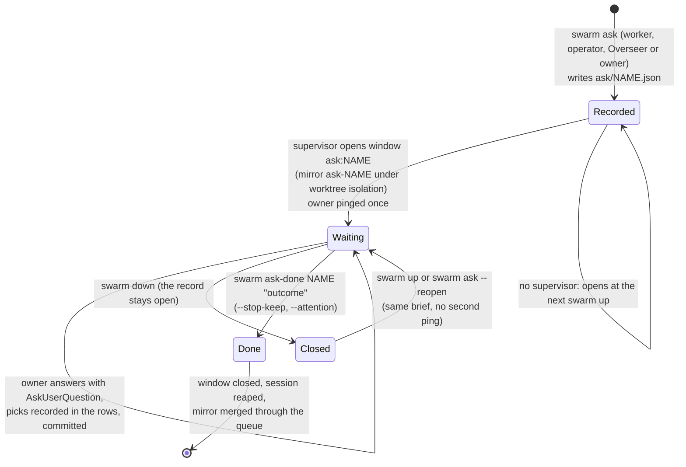

# The cast, in detail

What every moving part of swarm-orchestrator is, when it runs, what it decides and
what it may not do. The [README](../README.md) has the short version and the
diagrams; [config.md](config.md) has every setting; [cli.md](cli.md) every command.

## Supervisor

**What it is:** one long-running Python process (`swarm _supervise`), started
detached by `swarm up`, with no terminal of its own. It is the only reader of
`control.fifo`, so every event reaches it in a single total order. It is the only
process that spawns or kills the overseer pane, opens the operator session, and
drives the merge queue.

**When it runs:** from `swarm up` until the run finishes, `swarm finish`, or
`swarm down`.

**What it decides:**

- **Launching.** It launches ready phases straight from the ledger, in ledger
  order, into free slots, one thread per launch. No model decides what starts.
  A row ticked `[x]` with no record of the swarm's counts as done, as on the web
  board; a recorded `fail` still wins over a tick.
- **Merging and finishing.** It merges finished phases through the queue, and it
  finishes the run once nothing is busy, waiting, parked, launching, queued, held,
  owed as a push, owed as an operator hand-off or waiting on you in an ask, and
  no Overseer pass is due.
- **Failed launches.** A launch that fails (the worktree, the pane, or the boot,
  which is retried once) waits 60 s before it is tried again. After three failures
  in a row the phase is given up, and you are told once. `swarm launch <phase>` or
  `swarm resume` hands it back.
- **Scheduling.** It decides when to park a waiting worker, when an Overseer pass
  is due, and when to run gc.

**What it may not do:** it never builds, never retries a phase that finished
`fail`, and never restarts a worker. An exception in one event handler is logged,
telegrammed and stepped over. Only a failure of the loop itself ends the process,
and that announces itself (`SUPERVISOR-CRASH` plus a ping). Everything it does is
logged to `<state>/logs/supervisor.log`.

**Watchdog** (`[swarm].watchdog_s`, default 300, `0` = off): the supervisor's one
periodic poll. On each sweep it:

- frees a busy slot whose pane is gone, once seen on two sweeps in a row, and
  rolls back that phase's branch;
- relaunches when the swarm has been idle for a full interval with free slots and
  ready phases;
- finishes a run that has settled;
- tells you if a finished run still had ready phases;
- retries owed pushes, at most every 15 minutes.

A swarm that is moving is never touched. The sweep exists because a supervisor
that only reacts to input cannot notice a worker killed out-of-band, which never
sends `done`.

## Workers

**What they are:** full, unrestrained Claude Code sessions, one per slot, started
as `cd <cwd> && exec <worker_cmd> --settings <worker_settings> --effort <effort>`.
Their teammates run in-process (`teammateMode`), so they never open extra panes.
Each worker's environment carries:

- `SWARM_PHASE`, `SWARM_SESSION_ID=worker:<phase>` and `SWARM_STATE_DIR`
  (everything it starts dies with it: see [Processes](#processes-everything-dies-with-its-session-swarm-keep-is-the-exception));
- a private `TMPDIR` on disk under `<state>/tmp/<phase>`;
- `CARGO_INCREMENTAL=0`;
- under worktree isolation, also `SWARM_WORKTREE`, `SWARM_MAIN`, `SWARM_PROJECT`
  and the build-gate limits.

The folder-trust dialog is accepted ahead of time for every new mirror. The prompt
is typed in (pasted, for a slash command), then checked: it must actually appear
above the input box before the launch counts.

**What they decide:** everything inside their phase. The project's own worker
command (patched by the init pass) is their directive. It tells them to:

- build the phase;
- run heavy builds through `swarm build`;
- record the small calls they make with `swarm note`;
- ask you only about calls that are genuinely yours, or when in doubt about
  something that matters (`swarm waiting`, see
  [Answering the swarm](../README.md#answering-the-swarm));
- classify their own finish:
  - `ok`: clean success. It merges silently.
  - `operator`: merges exactly like `ok`, and the recap becomes the brief for an
    operator job.
  - `fail`: it is rolled back under worktree isolation, you are pinged, and the
    phase's dependents stay blocked until `swarm retry`.

**What they may not do:** under worktree isolation, they commit on `swarm/<phase>`
and never push; the integrator pushes. Nothing else is clamped: tools,
permissions and scope are the session's own.

`swarm done` prints what it did: whether the sentinel was written, the telegram,
the operator route, and the FIFO poke. A second call with a shorter recap never
overwrites a fuller one (`--force` to replace it), and every attempt is appended to
`done/<phase>.jsonl`. A recap under 20 characters or 4 words is too thin to brief
an operator. The sentinel is still written, but no job is queued.

## Init pass and the Overseer

Both run in window 1 (`overseer`), one at a time, and both are spawned and killed
only by the supervisor.

**The init pass** runs once per `swarm up`, and the first launch waits for it
(prompt: `prompts/init_master.md`). It:

- runs `swarm doctor` for the Telegram preflight (a missing Telegram setup is
  noted, never blocking);
- runs `swarm context` and reports ledger cycles or unknown dependencies with
  `swarm notify`;
- patches `[worker].command_file` for swarm mode (skip the phase picker, the
  self-classified `swarm done`, `swarm build`, `swarm note` / `waiting` /
  `resumed`, `swarm ask` for an owner review, the cost rules) and commits it, so every mirror inherits the patch;
- runs `swarm master-idle`.

It never asks you anything. If it cannot start, or dies without idling, launching
goes ahead without it.

**The Overseer** is a full Claude session that looks over the whole run and acts on
it (prompt: `prompts/overseer.md`). It is on by default (`[overseer]`).

- **When it runs:** a pass is triggered by events and counters, collected into one
  pending list (see [the diagram](../README.md#init-pass-and-overseer)). Only one
  pass runs at a time. Passes are `min_gap_s` apart, unless a reason is urgent: a held merge
  queue, a doctor FAIL, starvation, or `swarm overseer --now`.
- **What it reads:** before each pass the supervisor writes
  `<state>/overseer/digest-<id>.md` (and `.json`). It holds the trigger, the swarm
  now, every phase finished since the last pass with its recap and notes, every
  operator job finished since then with its outcome (flagged ones first),
  failures, questions and asks waiting on you, the `owner-run` rows whose
  dependencies have landed with no ask open, a starvation map (which root
  blockers hold how much backlog), and a snapshot of RAM, swap, `/tmp` and disk.
- **Where it works:** under worktree isolation, in its own mirror `ovs-<id>`,
  which merges through the ordinary queue when the pass ends.
- **What it decides, on its own:**
  - retry a failed phase once;
  - free a dead slot;
  - `swarm resolved` a hold it has fixed;
  - edit the ledger so free slots have work (split serial chains, file follow-up
    rows from workers' risks and decisions);
  - queue operator jobs;
  - open an ask for an `owner-run` row that waits on a review or a pick;
  - run `swarm gc`;
  - `swarm pause` when the box is in danger;
  - send you a digest of six lines at most.
- **What it may not do:**
  - answer a worker's question;
  - restrain a worker: edit its prompt, limit its tools or narrow its phase;
  - lift a pause you made;
  - run `done`, `up`, `down` or `finish`;
  - make owner-level calls (money, taste, scope, deleting work, reversing your
    written decisions). Those go to you through `swarm overseer-ask`.
- **How it ends:** it closes with `swarm overseer-done "<summary>"` and leaves
  `<state>/overseer/<id>.md` with *Saw*, *Did* and *Left for the owner*. A pass
  that runs past `timeout_s` is killed and its commits are merged anyway.
  `swarm overseer` lists recent passes.

## Operator

**What it is:** one Claude session in window 2 (`operator`) that carries out
concrete work a phase could not wait on: deploys and rolls, checks after a deploy,
provisioning, downloads, chores that span repos (prompt: `prompts/operator.md`). It
works with your authority, so it is **off unless you set
`[operator].enabled = true`**. While it is off, each hand-off is telegrammed to you
as a to-do instead of being dropped.

**Where jobs come from:**

- a phase finishing `swarm done <phase> operator "<recap>"`, where the recap is
  the entire brief;
- `swarm operator-add "<brief>" [--phase P]`, used by you or the Overseer;
- `swarm operator <phase>`, which builds a job from an old sentinel by hand.

**The queue:** one JSON file per job under `<state>/operator/`. `swarm done` writes
it after the sentinel and before the FIFO poke, so a crash between the two costs
nothing: `swarm up` rebuilds a missing item from its sentinel, and requeues jobs a
dead run left running or waiting.

**Triage:** `swarm operator-triage <job>` asks a cheap model (`triage_model`,
default `haiku`) whether the job should run `now` or `later`. Every odd answer
counts as `later`. `now` opens the session at once, or at the merge if its phase
is still building or merging: no job opens before its work is on main. Any job
opens when its phase has merged (unless triage said `later`), or from the queue
sweep, which runs on every supervisor wake and opens the oldest due job whose
phase is no longer building or merging. A `later` job can wait for the rest of
the run, so the sweep holds it until the run is quiet: no slot busy, nothing
launching, merging, held or ready to launch (a phase parked on you does not
count). `swarm operator <phase>` by hand turns a `later` into `now`.

**Leases and limits:** only one job runs at a time, under a lease in `state.json`.
The lease lasts 1 h, or 7 days while waiting on you. A job gets 3 attempts, with
5 minutes between them. After that it is `abandoned` and you are told once.

**Where it works:** under worktree isolation, in its own mirror `op-<job>` (reused
by a retry), merged through the ordinary queue on `operator-done`. Without
worktree isolation, it works in the project itself.

**What it decides:** how to carry out the brief. It first checks whether a later
phase or you already did the work. It narrates each action and prefers the step
it can undo. It ends with `swarm operator-done <job> "<outcome>"`. That pings you
only when the session adds `--attention`: you must act, something the brief
asked for is not done or still owed, or a check came back bad. Every other
outcome is recorded (on the job, in `notifications.jsonl` marked `suppressed`,
on the dashboard) and reaches you in the Overseer's next summary, which lists
every operator job finished since its last pass. `[operator].notify = "all"`
pings every outcome again; `"none"` pings none. Questions and abandoned jobs
always ping.

**What it may not do:** it asks you only about money, taste, unrecoverable data
loss, or contradicting something you decided in writing, through
`swarm operator-ask`. It never answers a worker's question. It never runs
`done`, `launch` or `finish`, and never creates branches of its own. `swarm finish`
refuses to stop the run while jobs are queued, unless you pass `--force`.

## Asks: where the owner answers review questions

**Why it exists.** A phase can build several design mockups and then need the owner to choose
between them. Such decisions lived in separate ledger rows
marked `owner-run` (`coral-W1`…`W3`: "the owner picks the layout", …),
which the swarm never launches, and the owner got a Telegram about the mockups
with nowhere to answer. So the swarm opens a waiting window in tmux: a small
session in its own window that waits for the owner, like a parked
worker, and the owner answers there.

**What it is.** An **ask session**: a Claude session in its own tmux window,
`ask:<name>`, in the swarm's session (prompt: `prompts/ask.md`, plus the brief).
It reads the named ledger rows and whatever the brief points at (URLs, files, a
kept server), shows you what to look at, and asks with AskUserQuestion in plain
product words. You answer only through that tool. It then records each answer in
its row, as a line `Owner's pick (<date>): …`, and ticks an `owner-run` row the
answer completes, following the project's worker command file
(`[worker].command_file`) for how a row is ticked and which ledger gate must stay
green. It ends with `swarm ask-done <name> "<one-line outcome>"`.

**Who opens one:**

- a **worker** whose phase produces something for you to review, when `owner-run`
  rows depend on it: it runs `swarm ask …` before its own `swarm done`, and never
  waits for the answer itself. The window opens once that phase has landed, as an
  operator hand-off does (`ASK-HELD` in the log until then), so what you review and
  the rows the ask edits are on main. If the worker started a server for the
  review, it keeps it with `swarm keep --why …` and names that keep in the brief.
  The init pass adds this to the worker command;
- the **operator** or the **Overseer**, the same way. The Overseer's digest lists
  the `owner-run` rows (`[tasks].exclude`) whose dependencies have landed and that
  no open ask names; it opens an ask for the ones you answer at a keyboard and
  names the physical ones ("something to try by hand") in its summary;
- **you**, by hand.

The supervisor never opens one by itself for every unblocked `owner-run` row:
many are physical tasks, and only the session that knows the context can write
the brief.

```
swarm ask --name <name> --rows <row>[,<row>…] --why "<one line>" "<brief>"
```

- `--why` is one plain line (at most 120 characters): what you decide. The brief
  says what to look at and where.
- `swarm ask` writes `<state>/ask/<name>.json` first, then pokes the supervisor,
  which opens the window on a thread (building a mirror and booting `claude` take
  tens of seconds its loop must not spend). With no supervisor running, the ask
  is recorded and opens at the next `swarm up`.
- A name whose window is alive is refused. A name that is open with no live
  window (it would not open, or the window was closed) takes the new brief and
  opens again; `swarm ask --reopen <name>` does the same with the brief it has. A
  finished name starts a fresh ask.

**What it holds, and what it does not.** An ask takes **no worker slot**, never
times out, and several can be open at once. It has no lease, no retry and no
timer: its record is its whole state.

- **One ping**, when its window opens (a necessary one, since it waits on you):
  `swarm: coral-W1, coral-W2 wait on you: answer in tmux window ask:coral (tmux
  attach -t <session>)`, then the `--why`. It is never sent twice for one ask,
  however often its window opens again. If the window will not open, that one
  ping says so and names `swarm ask --reopen <name>`.
- **The finish waits for it**, the way it waits for a parked phase: the run does
  not finish while an ask is open (`FINISH-HELD asks=[…]` in the log), and
  `swarm finish` refuses without `--force`.
- **Where it works.** Under worktree isolation, in its own mirror `ask-<name>`
  (branch `swarm/ask-<name>`), which merges through the ordinary queue on
  `ask-done`, like an operator job's; once it lands the launcher looks again, since
  a ticked `owner-run` row releases its dependents. Without isolation it works in
  the project and commits right away.
- **Its environment** is a session's: `SWARM_SESSION_ID=ask:<name>`,
  `SWARM_ASK=<name>`, `SWARM_STATE_DIR`, `SWARM_PROJECT`, and a `TMPDIR` under
  `<state>/tmp/ask-<name>`. The model is `[ask].model`, or `[swarm].master_model`
  when that is empty.

**`ask-done`.** `swarm ask-done <name> "<outcome>" [--stop-keep <keep>]…
[--attention]` records the outcome on the ask, durably, before anything else. It
then stops each kept process named with `--stop-keep` (the server that existed
only for this review), and pokes the supervisor. The supervisor closes the
`ask:<name>` window, reaps everything carrying `ask:<name>` (the existing
`reap_session`), and, under worktree isolation, lands the mirror. The outcome
follows the operator's quiet policy (`[operator].notify`): it pings only with
`--attention`, when you still have something to do, and otherwise reaches you in
the Overseer's summary.

**Recovery.** `swarm down` ends ask sessions like every other session: you cannot
answer a dead window. `swarm up` keeps an open ask's mirror, lands a finished
one's that never merged, and opens every ask that was open and not done again,
with the same brief, from its record.

**Where you see them:** `swarm ask --list` (open ones, then the last ten
answered: name, rows, why, age, and how to reach the window), `swarm status`,
`swarm doctor` (`owner.asks`, a WARN like `owner.blocking`, never a FAIL; it
flags an ask whose window is gone), the dashboard's asks tab (`a`), the web
board's read-only "Waiting on you" list, and the Overseer's digest. To answer:
`tmux attach -t <session>`, then `tmux select-window -t <session>:ask:<name>`.



## Integrator and merge-conflict resolver

Under `isolation = "worktree"` a finished phase joins the **merge queue**
(`integ_queue` in `state.json`). The supervisor lands one phase at a time, repo by
repo (components first, umbrella last), each under a per-repo `flock`:

- **Untouched repos** (no commits on the branch, main level with origin) are
  pruned with no network at all.
- **Changed repos:**
  1. Check that the canonical tree has no uncommitted tracked edits.
  2. Merge `origin/main` in.
  3. `merge --no-ff swarm/<phase>`.
  4. Push. A non-fast-forward rejection is reconciled by merging origin again and
     retrying, up to 5 rounds.
  5. Remove the worktree and branch.

Before it opens a session, a conflicted merge is offered to the mechanical
resolver (`automerge.py`) through `[git].auto_resolve`, a map from a path glob to
a strategy:

- **`union`:** a real three-way merge that keeps both sides where they differ.
  It suits append-only journals.
- **`keyed:<regex>`:** splits the file into records keyed by the regex's first
  group and merges per key. Only a key both sides changed differently is a
  conflict. It suits a ledger where two phases tick their own adjacent lines.

It is all-or-nothing: if any conflicted file has no strategy, or a strategy
declines, the tree is left exactly as the failed merge left it.

A merge can end four ways:

| outcome | meaning | what happens |
|---|---|---|
| merged | every repo clean, pushed or push owed | the phase is recorded done, its mirror removed, the slot refilled |
| conflict | a repo is mid-merge | the queue is **held**; a **resolver** session opens in window `resolve-<phase>`, in that repo |
| dirty | a canonical repo has uncommitted tracked edits | the queue is held; you commit or stash, then `swarm resolved <phase>` |
| push failed | merged locally, the push was refused or the remote was unreachable | not a hold: the repo **owes a push** (below) |

The **resolver** is a Claude session (prompt: `prompts/resolver.md`) that:

- resolves every conflict marker so that both sides' intent survives;
- commits the merge and runs `swarm resolved <phase>`;
- if it cannot resolve correctly, tells you and stops, leaving the merge in
  progress;
- never pushes and never launches.

`swarm resolved` re-checks the repo (no merge in progress, clean tree) before
releasing the queue. A premature call keeps the hold and pings again.

A phase that finishes `fail` is rolled back in every repo: worktrees and branches
are removed, with no merge.

[The integration flow diagram](../README.md#integrator-and-merge-conflict-resolver) is in the README.

**Owed pushes** (`pushowed.py`): later workers branch from local main, so a push
that failed does not hold anything back. The repo is recorded in `push_owed`, and
you are pinged once if it still owes a push after `[telegram].push_owed_grace_s`
(1 h), and once more when it clears (immediately and at clearing under
`[telegram].pings = "all"`). The push is
retried after every integration and on the watchdog tick, and it clears as soon
as origin has local main, whoever pushed it. `swarm status` and `swarm doctor`
show the standing debt.

`swarm integrate <phase>` runs the same integration by hand, outside the queue.

## Processes: everything dies with its session; `swarm keep` is the exception

Every shell a session starts is cleaned up with it.
So a session's end ends every process it started.

**The marker.** Every session is spawned with `SWARM_STATE_DIR` and its own
`SWARM_SESSION_ID=<kind>:<id>`: `worker:<phase>` (a worker also carries
`SWARM_PHASE`), `operator:<job>`, `overseer:<pass>`, `resolver:<phase>`,
`ask:<name>`. Everything
the session starts inherits them, so a child that detached itself (`setsid`,
`nohup`, `&`, reparented to init) is still found by its environment.

**When a session ends:**

| session | ends at | what the supervisor does |
|---|---|---|
| worker | `swarm done` (any status), or the watchdog finding its pane dead | returns the slot's pane to `sleep` before the slot can be refilled, then reaps `worker:<phase>` |
| operator | `operator-done`, a lease that expired, the run stopping | respawns the operator pane to idle, then reaps `operator:<job>` |
| Overseer | `overseer-done`, or its timeout | clears the master pane, then reaps `overseer:<pass>` |
| resolver | `swarm resolved` closing its window | kills the window, then reaps `resolver:<phase>` |
| ask | `swarm ask-done`, or `swarm down` | kills the `ask:<name>` window, then reaps `ask:<name>` |

Reaping is `swarm down`'s code narrowed to the session's markers within this run:
SIGHUP, then SIGTERM, then SIGKILL to what outlived each, process groups
included. It runs off the supervisor's loop, 2 s after the session's end (so its
own `swarm done` can print), and the supervisor waits for pending reaps before it
exits. It never signals itself, its ancestors or a tmux server. Each reap is
logged as `REAP <kind>:<id> ended=N`.
The swarm's own helpers that `swarm done` starts detached (the grace poke, the
recap, the operator triage) are spawned without the session's markers, so they
finish their job after the worker is gone.

**`swarm down`** still ends everything carrying the run's `SWARM_STATE_DIR`,
orphaned sessions and whatever detached from them included.

**`swarm keep`** is the one sanctioned way to leave something running, and
sessions are told to use it only when something must outlive them, such as a page
the owner needs to open:

    swarm keep --name look-mockups --why "serves the look mockups for the owner's layout picks" \
        --cwd "$SWARM_PROJECT" -- python3 -m http.server 8790 --bind 0.0.0.0 --directory tasks/mockups/look

- It starts the command fully detached (its own session), with `SWARM_STATE_DIR`,
  `SWARM_SESSION_ID`, `SWARM_SESSION`, `SWARM_PHASE` and a session `TMPDIR`
  removed from its environment, so no reaper matches it. The kept pid and its
  start time are also excluded from every sweep, as a belt.
- `--why` is required: one plain line (at most 120 characters) a non-developer
  can read. A name is unique: a live one is refused, a dead one replaced.
- It records `<state>/keep/<name>.json` (pid, start time, argv, cwd, who started
  it, why, log) and logs output to `<state>/keep/<name>.log`. It warns when its
  cwd is inside a mirror, which goes when the session's work merges.
- `swarm keep --list [--json]` lists every kept process, alive or dead;
  `swarm keep --stop <name>` sends its group SIGTERM, then SIGKILL, and forgets it.
- `swarm status`, `swarm doctor` (`keep`, a WARN for one alive past 7 days, never
  a FAIL) and the dashboard list them, with their why and how to stop them.
- A session that keeps something says so in its recap or outcome: the name, what
  it serves and `swarm keep --stop <name>`. For the operator that outcome needs
  the owner, so it gets `--attention`.

## Worktree isolation and mirrors

With `isolation = "none"` (the default) every worker commits in the project itself,
and the ledger's dependencies are what keep phases apart.

With `isolation = "worktree"` each phase gets a **full mirror of the whole
workspace** under `<state>/wt/<phase>`. That is a worktree of the umbrella repo on
branch `swarm/<phase>`, with a worktree of every component repo nested inside it at
its real path, on the same branch. Component worktrees are created up to 6 at a
time, one nesting level at a time. `[git].repos` globs pick the component repos
(default: every git repo directly under the project root).

- The worker's cwd looks exactly like the project, and nothing it does touches the
  canonical repos or another phase's mirror.
- Two phases may build in the same repo at the same time.
- A mirror starts from local main, unless `origin/main` strictly fast-forwards it,
  so unpushed commits of yours are never dropped.
- A mirror is all-or-nothing: if any repo fails to check out, every repo is
  discarded.
- With `[build].cache`, a Rust worktree's `target/` is a symlink to one shared
  per-repo cache, so only changed crates recompile. This happens only where the
  repo gitignores `target`.

Operator jobs (`op-<job>`), Overseer passes (`ovs-<id>`) and asks (`ask-<name>`)
get mirrors the same way.

On `swarm up`, leftover `swarm/*` branches are reconciled from the durable
sentinels, never from branch shape:

- A phase with an `ok` or `operator` sentinel has its integration completed.
- A branch with no sentinel was interrupted mid-build. It is discarded and the
  phase is rebuilt.
- A phase whose integration is still held is **not** recorded done. The run
  starts visibly held instead.

## Build gate (`swarm build`)

N workers in N worktrees means N independent builds. `swarm build <cmd…>` is a
swarm-wide counting semaphore: one `flock` per slot under `<state>/buildsem/`, at
most `[build].max_concurrent` held at once, the rest waiting.

It then `exec`s the command, so the build process itself holds the lock. If a
build is killed (by a tool timeout, for example), its slot is released with it:
no daemon, no leak. For `cargo` it also sets `CARGO_BUILD_JOBS` to
`[build].jobs`.

Workers are told to wrap their gates in it (`swarm build cargo nextest run`), and
to give those commands a generous timeout, since they may queue. Automatic gc
takes every build slot before it deletes anything, so it never runs during a
build.

## Stop hook, recaps, notes and the report

**Stop hook** (`scripts/stop-hook.py`, opt-in): register it as a `Stop` hook in
`[worker].worker_settings` (see [config.md](config.md)). At every turn
boundary it appends the worker's final message to `<state>/turns/<phase>.jsonl`. It
costs no API call, never fails the turn, and prints nothing. It feeds the recaps,
the board's "last turn", and the Overseer's digest.

**Recaps** (`swarm recap <phase> [--force]`): a summary of one or two sentences of
what a phase did, stored in `<state>/recaps/<phase>.json`. They are made at two
moments only:

- `swarm done` spawns one in the background (reusing a good existing recap);
- you ask for one with `swarm recap`.

They are never made on a timer. A short completion note is used as is. Otherwise
`claude -p --model haiku` summarizes the last turns.

**Notes** (`swarm note <phase> [decision|assumption|risk] "<text>"`): the silent
middle register between finishing quietly and stopping to ask. A note pings
nobody, parks nothing and costs no slot. Your own answers, relayed by
`swarm resumed`, `operator-resumed` and `overseer-resumed`, are stored as
`owner_decision` notes. All of them live in `<state>/notes/<phase>.jsonl`.

**Report** (`swarm report [--decisions] [--phase P] [--json]`): one row per phase
with status, finish time, time in slot, time to integrate, and recap, plus
warnings where the records disagree. These include a sentinel that contradicts
`state.json`, a recap overwritten, and a ping that was owed or never delivered.
`--decisions` keeps only phases with notes or substantial recaps, and puts your
decisions first.

## Meters, usage and runs

Each worker's status line is swapped for a small tap (`meters.py`). It records
what Claude Code already hands its status bar:

- context size and session cost, in `<state>/meters/<phase>.json`;
- 5-hour and weekly subscription usage with their reset times, appended to
  `meters/limits.jsonl` whenever a figure moves.

It then runs your own status-line command, so the pane looks unchanged. A project
whose `worker_settings` sets its own `statusLine` keeps it and gets no tap.

A **run** is the span from `swarm up` to `swarm down`. `swarm reset` (or `R` in
the dashboard) closes the open run and starts a new one without restarting
anything, so ETA and usage count from that moment. Runs live in
`<state>/history/runs/<id>/`, and a mid-run change to the worker count or
isolation splits the run's averages.

`swarm usage` shows the open run and the past ones: hours, phases, average
5-hour %/h and weekly %/h, the 5-hour windows spanned, and $/h. The 5-hour and
weekly figures are account-wide, so other Claude sessions on the same account
during a run count too.

The same numbers, shortened to four lines, reach your phone twice
(`usage.brief`): at the bottom of the Overseer's summary ping, and as the answer
to `/usage` (see [Telegram](#telegram-and-asking-the-owner)):

```
usage (as of 14:05, 3 min ago):
5-hour 23% · resets 16:00
weekly 41% · resets Wed 11:00
this run (6.2 h): 5-hour 2.1 %/h · weekly 0.9 %/h · 14 phases · $/h 11.05
```

A sample arrives only when some session renders its status line, so the first
line says how old it is, and `stale` past 30 minutes. With no sample at all the
first three lines are one line saying so. `swarm usage` prints the same age on its
`sample` line.

## Doctor, why and gc

**`swarm doctor [--json]`** answers "what is wrong right now?". It is read-only,
and exits 1 if any check FAILs. It checks:

- **supervisor:** pid alive, FIFO has a reader, no stray second supervisor;
- **slots:** busy panes run `claude`; a busy slot with no edits or commits
  20 minutes after launch (the lost-prompt signature);
- **run:** watchdog, finished with ready work, free slots beside ready phases,
  no event for 90 minutes;
- **integration:** hold age, owed pushes;
- **owner:** questions waiting on you, and open asks (`owner.asks`, a WARN,
  never a FAIL);
- **ledger:** cycles and unknown dependencies;
- **telegram:** config valid, and whether sends were ever made or dropped;
- **disk:** state-dir size and growth, incremental caches, a full `/tmp`;
- **records:** sentinel and state agreement, forced recaps, failed phases,
  operator jobs waiting over an hour or abandoned, prompt files present, and the
  web board.

**`swarm why <phase> [--tree]`** gives one answer per phase:

- not in the ledger, excluded (quoting your `.swarm.toml` comment), building,
  held, queued to merge, waiting, parked, done or failed;
- blocked, with the root blockers found by walking its unmet dependencies;
- ready, with what is stopping it (paused, or no free slot).

**`swarm gc`** reclaims disk. It is a dry run that prints a plan unless you pass
`--yes`.

- **Always planned:**
  - build caches of repos that no longer exist;
  - `incremental/` directories;
  - superseded cargo units: every unit that is not recent, not built by a live
    phase and not the newest of its kind (nor a dependency of one of those),
    so a shared cache holds about one generation per repo;
  - `cargo sweep` of build output unused for `[gc].keep_days` (needs
    `cargo-sweep`);
  - orphan mirrors in `wt/`;
  - stale session temp dirs;
  - a report of large leftovers in `/tmp`.
- **Opt-in flags:**
  - `--aggressive`: `release/`, `doc/` and more;
  - `--transcripts`: orphan worker transcripts in `~/.claude/projects`;
  - `--branches`: merged `swarm/*` branches;
  - `--canonical`: paths inside the project's own repos.
- **Safety:** it takes every build-gate slot first, refuses while a compiler runs
  in a tree it would touch (unless `--force`), and re-checks every path at delete
  time against a protected list.
- **Automatic runs:** the supervisor runs a conservative gc by itself (`[gc]`) at
  most every 15 minutes, plus once per idle stretch, and never during a build.

## The dashboard (`swarm tui`)

A Textual app in window 0 (`dash`), started by `swarm up` under tmux. It re-reads
the state every 2 s, and probes panes and git every 10 s. The status bar shows:

- live, paused, finished, or supervisor down;
- busy slots;
- campaign progress;
- the time since the last event, which turns amber after 30 minutes and red after
  2 hours while a slot is busy;
- how many phases wait on you.

`n` opens the **needs-you** drawer. `1`–`9`, `0` and `a` switch between the tabs:

1. **home:** campaign headline, ETA, usage outlook, needs you, working now, a
   chart of phases done, and a feed of finishes, decisions, answers, operator
   outcomes and Overseer passes.
2. **workers:** one row per slot. A busy slot whose pane died shows `gone`.
3. **history:** every phase run, with what it did.
4. **alerts:** the notification log. `F` cycles all, failed and delivered.
5. **disk:** sizes of mirrors, caches and the state dir. Scanned on demand (`r`).
6. **settings:** a typed form over every config key, with its reload class.
   Applying it edits `.swarm.toml` in place, keeping comments, then runs
   `swarm reload`.
7. **commands:** every subcommand, runnable with streamed output. Destructive
   ones (`down`, `finish`, `free`, `skip`, `done`, `retry`, `integrate`,
   `operator-done`, `gc --yes`, `reset`) ask for confirmation.
8. **doctor:** runs `swarm doctor` on demand.
9. **runs:** past runs with their per-hour figures.

Two more sit beside them:

- `0` **shells:** what `swarm keep` left running, with why; `x` stops one.
- `a` **asks:** open asks (and the last answered ones) with their rows, what you
  decide, their age, and the `tmux select-window` that reaches each window.

`R` resets the run (after a confirmation), `?` opens help, and `q` quits the
dashboard only. It fits an 80×24 terminal: panels stack, the chart drops out and
columns hide as it narrows.

## The web board (`swarm web`)

A read-only Kanban board for a phone or a browser on the LAN. Under tmux,
`swarm up` starts it in the last window (`web`). Under the `bare` driver, it runs
as a detached process. `swarm down` stops it. `swarm up`, `swarm status` and
`swarm doctor` print its LAN address.

**Columns:** Needs you, Blocked, Ready, Building, Merging / held, Operator, Done,
Failed, Excluded. Rows ticked in the ledger count as done.

**Views:**

- **Campaigns:** swimlanes by phase-id prefix, each described from a ledger
  heading or the ADR most of its rows cite.
- **Activity:** "Waiting on you" (open asks: rows, what you decide, how to reach
  the window; never the brief), what `swarm keep` left running, recent Overseer
  passes and finishes.
- **Card sheet:** the ledger row, recap, notes, dependencies, operator jobs and
  attempts. Deep links use `#phase=<id>`.
- **Header:** usage meters, ETA, and the last Overseer pass.

Updates arrive live over Server-Sent Events.

It is plain `http.server`, GET and HEAD only, and no URL path ever maps to a file.
Every payload is scrubbed of credential-shaped strings. It is **open on the LAN
with no token**, by design (`[web].host = "0.0.0.0"`). `/healthz`
answers `{"app": "swarm-web", "project": …}`, which is how `swarm up` tells its own
board from another program holding the port.

Under WSL with mirrored networking, a phone reaches the board only once Windows
lets the port in:

```powershell
New-NetFirewallRule -DisplayName "swarm web" -Direction Inbound -Protocol TCP -LocalPort 8765 -Action Allow
```

If it still does not answer, also run
`Set-NetFirewallHyperVVMSetting -Name '{40E0AC32-46A5-438A-A0B2-2B479E8F2E90}' -DefaultInboundAction Allow`.
Both need an elevated PowerShell.

## Telegram and asking the owner

The swarm has its own sender: `scripts/notify.sh`, with a bot of its own. It reads
`TELEGRAM_BOT_TOKEN` and `TELEGRAM_CHAT_ID` from this repo's
`.env`, which is gitignored; `scripts/resolve-chat-id.sh` fills in the chat id.
Point `[telegram].notify` at any script that takes the message as `$1`.

Messages are plain text, capped at 3800 characters. A `swarm notify` sent from an
Overseer pass is its summary: it ends with the usage block, and the summary is cut
first if the whole would pass the cap. Every send, delivered or not,
is logged to `<state>/notifications.jsonl`, and the dashboard's alerts tab reads
that log. A message the swarm holds back on purpose is logged there too, with
`delivered: false` and a `suppressed` reason; the dashboard shows it as `·`, not
as a drop, and `swarm doctor` does not count it as one. `swarm notify "<text>"` is the only way a session should message you.
Every shipped prompt, and the init pass's patch to the worker command, says so
in so many words: use `swarm notify` even when a brief, a ledger row, a recap or
a project document names another script (a `notify.sh`, say). A message
sent that way would not come from the swarm's own bot and would not be logged.
An operator's result that needs you
(a URL to open, something only you can do) goes in its `operator-done` outcome
with `--attention`.

**What pings you.** Only necessary messages ring, so by default
(`[telegram].pings = "necessary"`) the phone rings only for these:

- a worker, the operator or the Overseer asking you something;
- an ask whose window opened (once per ask: rows wait on you, and where to answer);
- a merge hold you must clear: a dirty tree, or a conflict no resolver could
  start. A conflict a resolver is working on is not sent; if the resolver cannot
  fix it, it messages you itself (`swarm notify`);
- an operator job's outcome flagged `--attention`, an abandoned job, or a to-do
  while the operator is off;
- a phase that fails again after the Overseer's retry. With the Overseer on, a
  first `fail` is its to handle (it retries a failed phase once); with it off,
  every `fail` pings. Which failure this is comes from `done/<phase>.jsonl`: a
  `swarm done` that finds no sentinel of its status opens a new episode
  (`"fresh": true`), and `swarm retry` removes the sentinel;
- a repo still owing a push after `[telegram].push_owed_grace_s` (default 1 h),
  checked after every integration and on the watchdog tick; the "pushed" ping
  follows only if the "owed" one went out;
- a phase that would not start (`spawn-fail`, `worktree-fail`), once per phase;
  a launch given up after repeated failures; a worker that died without
  `swarm done`;
- a supervisor crash or error; a master that would not start, or an Overseer
  pass that would not start or ran past its timeout, on the third in a row (and
  every third after that);
- the Overseer's summary, with the usage block, on a cadence pass
  (`[overseer].every_finished`) or a pass you asked for (`swarm overseer --now`).
  Any other pass (the clock, starvation, a hold, a doctor FAIL, an owner wait)
  records its summary without sending it, unless it runs
  `swarm notify --attention` because something needs you. The digest tells the
  pass which case it is in;
- a note from the init pass or a resolver (`swarm notify`);
- the finish summary, with the usage block;
- the bot's answers to your `/usage` and `/help`.

**Logged, not sent:** routine operator outcomes (the Overseer's digest lists
them), parks (you were asked when the phase started waiting), a first `fail`, a
push owed for less than the grace (and its clearing), a conflict a resolver is
working on, an ask's outcome without `--attention`, a web board that did not
start (`swarm up` prints it), a single master or Overseer failure, a repeat
failed start, and the summary of any other Overseer pass. Each goes to `notifications.jsonl` with `delivered: false` and a
`suppressed` reason, shows on the dashboard's alerts tab as `·`, and is not
counted as a drop. `[telegram].pings = "all"` sends all of them again, as before.
`ok` finishes are silent either way.

Question pings start with what the wait costs, for example
`3 phases blocked behind this · slot held · asked 14:05`, and the question is cut to
600 characters. The full text is on screen in the asker's pane.

**Commands (`tgbot.py`).** The bot also listens, so you can ask it:

- `/usage`: the usage block above, read when you ask;
- `/help` (and `/start`): the list.

The listener long-polls `getUpdates` with the same token and answers through the
same sender. It answers only messages from the chat in `TELEGRAM_CHAT_ID`, and
ignores every other chat without a reply. It also ignores plain text, edits, and
commands older than 15 minutes (sent while nothing listened). The next update id
is saved in `<state>/telegram-bot.offset.json` before an update is answered, so
none is ever answered twice.

- **Lifecycle:** `swarm up` starts it as a detached process under either driver
  (no tmux window), with its log in `<state>/logs/telegram-bot.log`. `swarm down`
  stops it, and its reaping would find it anyway, since it carries the run's
  `SWARM_STATE_DIR`. `swarm telegram-bot` runs it in the foreground. `swarm status`
  and `swarm doctor` (`telegram.bot`) say whether it runs and what it is doing.
  `[telegram].commands = false` turns it off.
- **One poller per token:** Telegram answers `409 Conflict` when two programs poll
  one bot (or a webhook is set). Two projects on one box share the bot through
  this repo's `.env`, so a lock per token (in `$XDG_RUNTIME_DIR`) keeps the second
  listener waiting to take over, retrying every minute; `/usage` then answers from
  the project that holds it. A 409 from anything else is logged, shown by
  doctor, and backed off from 60 s up to 10 minutes. `scripts/resolve-chat-id.sh`
  polls the same token, so run it while the listener is stopped.
- **Failures:** network errors back off from 5 s up to 5 minutes, a rejected token
  waits 10 minutes, a 429 waits as told. None of it touches the supervisor.

## Reload, layout and check

**`swarm reload [--dry-run]`** applies a `.swarm.toml` edit to the running swarm.
Every key is classed as *hot* (applied now), *next* (reaches the next session
launched) or *restart* (refused and held). A key that a `SWARM_*` variable
shadows is reported as such. A file that does not parse changes nothing. Growing
`max_workers` adds panes, filling the last worker window up to
`[tmux].panes_per_window` before opening the next `workers-N`. Shrinking it
retires the surplus slots once they are free.

**`swarm layout [name]`** re-arranges the worker panes live. The choices are
`auto`, `side-by-side`, `top-bottom`, `tiled`, `main-vertical` and the rest. With
no argument it prints the current layout and every valid name.

**`swarm check [--strict]`** is a preflight that needs no running supervisor:

- the Telegram sender and its credentials;
- ledger parse and structure;
- **promptlint** (`promptlint.py`) over your worker command file and the shipped
  prompts.

Promptlint flags sentences the code has made false as *contradicted*: a `swarm`
subcommand that does not exist, "an agent call is synchronous", the retired
`needs-owner` status, or a claim that no status sends a Telegram. It flags
measured time-wasters as *wasteful*: `sleep` loops, `git status` polling, and
heredoc string-replace edits. The command exits 1 on a
Telegram or ledger failure, or on a *contradicted* finding.
